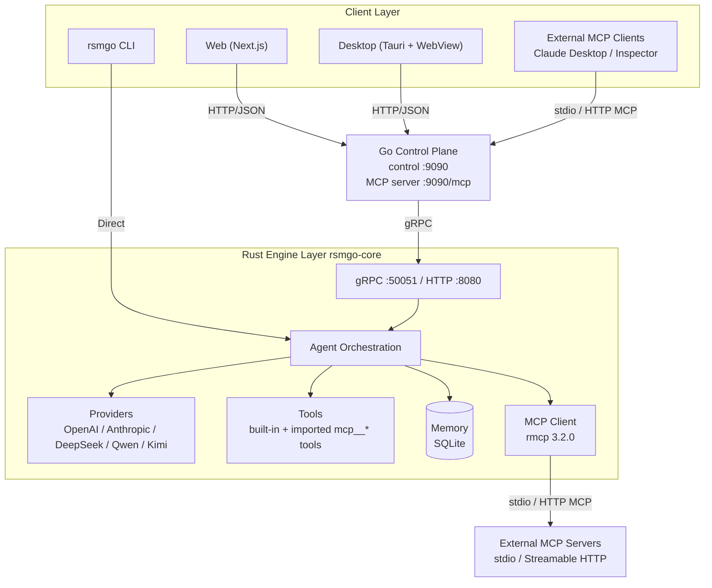

# rsmgo

> A model-agnostic AI Agent infrastructure.

**Language**: English | [中文](readme-zh.md)

rsmgo lets you connect to your preferred large language model (Claude, GPT, DeepSeek, Qwen, Kimi) and run an agent runtime locally with memory persistence and tool-call orchestration. The project is built with a polyglot architecture: Rust powers the core engine, Go runs the control plane and web gateway, Next.js provides the web UI, and Tauri wraps the desktop client.

---

## Table of Contents

- [Core Features](#core-features)
- [Architecture](#architecture)
- [Technology Stack](#technology-stack)
- [Directory Structure](#directory-structure)
- [Quick Start](#quick-start)
- [Configuration](#configuration)
- [Tool Usage](#tool-usage)
- [Docker Deployment](#docker-deployment)
- [Troubleshooting & Notes](#troubleshooting--notes)
- [HTTP Debug API](#http-debug-api)
- [Component Reference](#component-reference)
- [Future Evolution](#future-evolution)
- [License](#license)

---

## Core Features

- **Model-agnostic**: Unified LLM provider abstraction. Supports OpenAI, Anthropic, DeepSeek, Qwen, Kimi, and any other OpenAI-compatible endpoint. Adding a new provider only requires a `base_url` and a model list.
- **Agent runtime**: Built-in ReAct-style loop. The model can decide to invoke tools, and tool results are automatically fed back for follow-up reasoning.
- **Memory persistence**: Session and message history are stored in SQLite for long-term, cross-session memory.
- **Tool calling**: Built-in tools for file reading/writing, command execution, directory listing, file searching, web search, and URL fetching. Tool definitions use JSON Schema so models can understand them. Tools are disabled by default; users must explicitly enable them in the frontend tool menu, preventing ordinary chat questions from being forced into tool calls.
- **Multimodal attachments**: Supports uploading images, PDFs, DOCX, and text files. Images are sent as multimodal content to vision-capable models; text and document content is extracted and embedded into the user message.
- **DSML/XML tool-call compatibility**: Some OpenAI-compatible models (e.g. DeepSeek, Kimi) emit tool calls inside message content as `<| | DSML | | tool_calls>` markup. The engine automatically parses this markup, executes the corresponding tools, and strips the raw markup from the final reply.
- **Multi-protocol access**: The core engine exposes both gRPC (efficient internal communication) and HTTP/JSON (easy for frontends and third parties).
- **Multiple clients**: Command-line CLI, Next.js web UI, and Tauri desktop client.
- **Control-plane gateway**: The Go control plane handles session management, routing, CORS, and frontend proxying, decoupling the engine from the UI.
- **Stop generation**: Stop an in-flight chat from the UI — the frontend aborts the request and asks the control plane to cancel the engine-side generation.
- **Rich rendering & message actions**: Assistant replies are rendered as Markdown with per-language syntax-highlighted code blocks and one-click copy; each assistant message has a copy button, and the last message offers a regenerate button to re-run the previous answer in place.
- **Workspaces**: Add and manage local directory workspaces from the sidebar, each with a per-tool permission list. When a session selects a workspace, the agent reads and writes directly inside that directory (its true working directory) and is restricted to the workspace's allowed tools; without a workspace, files fall back to the default `outputs/` directory with a download link.
- **MCP protocol support**: Two-way Model Context Protocol integration. As an MCP client, the engine imports tools from external MCP servers (stdio or Streamable HTTP) and registers them as `mcp__{server}__{tool}` tools; as an MCP server, the Go control plane exposes the engine's full tool set to external MCP clients over stdio (`rsmgo-control mcp`) or HTTP (`/mcp`).
- **Environment-aware configuration**: `app.yaml` supports `${VAR}` environment variable expansion and `~` home-directory shorthand for flexible deployment.

---

## Architecture



### Design Highlights

1. **Engine layer (`rsmgo-core`, Rust)**
   - Handles LLM interaction, tool orchestration, memory access, and gRPC/HTTP serving.
   - `Agent` is the orchestration core: receive request → enrich with historical memory → call provider → if tool calls exist, execute them → submit results back to the model for a final response.
   - Tools are only exposed to the model when the request explicitly specifies `tool_names`; the frontend does not enable any tools by default, so normal chat questions do not trigger tool calls.
   - For OpenAI-compatible models that emit tool calls as DSML/XML inside `content`, the engine parses the markup, executes the tools, and strips the raw markup from the reply shown to the user.
   - `ProviderRegistry` supports registering multiple providers at runtime. Anthropic uses its native protocol; everything else is treated as OpenAI-compatible.
   - `MemoryStore` provides transactional session and message storage via `rusqlite`.
   - The `mcp` module implements an MCP client on rmcp 3.2.0: at startup it connects to external servers listed in `mcp_servers` (stdio child processes / Streamable HTTP), wraps their tools as `mcp__{server}__{tool}`, and registers them in the same tool registry and execution path as built-in tools. A server that fails to connect is logged and skipped without blocking startup.

2. **Control plane (`control`, Go)**
   - Acts as a gateway between frontends and the engine, exposing a unified RESTful API under `/api/v1/*`.
   - Responsible for session CRUD, workspace management, chat cancellation, message forwarding, health checks, and CORS.
   - Communicates with the Rust engine through a gRPC client.
   - The `mcp` package implements an MCP server on modelcontextprotocol/go-sdk: it fetches the engine's tool list at startup, registers a proxy handler per tool, and exposes them over `rsmgo-control mcp` (stdio) or `/mcp` (Streamable HTTP) to external MCP clients.

3. **Frontend layer**
   - **Web**: Chat interface built with Next.js 16 and React 19. `next.config.js` rewrites `/api/*` to the control plane. The UI offers a stop button to cancel in-flight generation and a sidebar for managing local workspace directories.
   - **Desktop**: Tauri 2 shell embedding the same web frontend (statically exported at build time), so it inherits every web feature.

4. **CLI (`rsmgo-cli`, Rust)**
   - Links directly against `rsmgo-core` and can run interactive or one-shot chats without the control plane.

---

## Technology Stack

| Layer | Technology | Rationale |
|-------|------------|-----------|
| **Core engine** | Rust + Tokio | High-performance async runtime with memory safety, well suited for LLM inference orchestration and tool-call heavy I/O workloads. |
| **Engine web/gRPC services** | Axum + Tonic | Axum provides a modern HTTP API, Tonic provides high-performance gRPC, both deeply integrated with the Tokio ecosystem. |
| **Control-plane gateway** | Go + Gin | Go is mature and efficient for cloud-native gateways, HTTP routing, and concurrency; Gin is lightweight and widely adopted. |
| **Inter-service communication** | gRPC + Protocol Buffers | Efficient RPC between the control plane and engine; Protobuf offers strongly typed, cross-language interface contracts. |
| **Persistence** | SQLite (via `rusqlite`) | Lightweight, zero-config storage for local sessions and message history without requiring a separate database service. |
| **MCP integration** | rmcp 3.2.0 (Rust) / modelcontextprotocol/go-sdk (Go) | Two-way Model Context Protocol support: the Rust engine acts as an MCP client importing external tools, while the Go control plane acts as an MCP server exposing the tool set. |
| **Web frontend** | Next.js 16 + React 19 + TypeScript | Modern React full-stack framework with App Router, SSR, and a great developer experience. |
| **Desktop client** | Tauri 2 | Embeds the frontend via the system WebView, yielding smaller bundles and lower resource usage than Electron. |
| **Configuration** | YAML + `serde_yaml` | Human-readable config format with support for environment-variable expansion and home-directory shorthand. |
| **Build tools** | Cargo / Go Modules / pnpm | Standard package managers and build tools for the Rust, Go, and Node ecosystems respectively. |

---

## Directory Structure

```text
rsmgo/
├── Cargo.toml                 # Rust workspace root
├── go.mod                     # Go module root
├── package.json               # pnpm workspace / script entrypoint
├── Makefile                   # Build, test, and code-generation tasks
├── app.yaml                   # Default runtime configuration (example)
├── app.exam.yaml              # Example with multiple providers
├── proto/
│   └── rsmgo.proto            # gRPC/Protobuf service definitions
├── crates/
│   ├── rsmgo-core/            # Rust core engine library + rsmgo-engine binary
│   │   ├── src/
│   │   │   ├── agent/         # Agent orchestration logic
│   │   │   ├── config/        # app.yaml loading and parsing
│   │   │   ├── memory/        # SQLite memory store
│   │   │   ├── mcp/           # MCP client (rmcp: stdio / HTTP tool import)
│   │   │   ├── providers/     # LLM provider abstraction and implementations
│   │   │   ├── server.rs      # gRPC + HTTP server
│   │   │   ├── tools/         # Tool registry and built-in tools
│   │   │   ├── types.rs       # Core domain types
│   │   │   └── bin/
│   │   │       └── rsmgo-engine.rs  # Engine entrypoint
│   │   └── Cargo.toml
│   ├── rsmgo-pb/              # Generated Rust protobuf code
│   │   └── src/
│   └── rsmgo-cli/             # Command-line client
│       └── src/main.rs
├── control/                   # Go control plane
│   ├── cmd/rsmgo-control/     # Control-plane main program
│   └── internal/
│       ├── api/               # HTTP API and routing
│       ├── config/            # Go-side configuration loading
│       ├── engine/            # gRPC engine client
│       ├── mcp/               # MCP server (go-sdk: stdio subcommand + /mcp HTTP)
│       ├── session/           # Session file storage
│       └── workspace/         # Workspace directory storage
├── pb/                        # Generated Go protobuf code
├── web/                       # Next.js web frontend
│   ├── app/                   # App Router pages
│   ├── components/            # React components
│   └── lib/api.ts             # Control-plane API client
└── desktop/                   # Tauri desktop client
    └── src-tauri/             # Tauri Rust shell project
```

---

## Quick Start

### Prerequisites

- Rust ≥ 1.85
- Go ≥ 1.26
- Node.js ≥ 20 + pnpm 9
- `protoc` (only if regenerating gRPC code)

Detailed installation steps:

1. Go to https://go.dev/dl/ and install Go for your operating system. Linux or macOS is recommended.
2. Set the Go module proxy (recommended for users in China):
   ```shell
   go env -w GOPROXY=https://goproxy.cn,direct
   ```
3. Install `protoc`:
   - On macOS:
     ```shell
     brew install automake libtool protobuf
     ```
   - On Linux:
     ```shell
     # Reference: https://grpc.io/docs/protoc-installation/
     PB_REL="https://github.com/protocolbuffers/protobuf/releases"
     curl -LO $PB_REL/download/v3.15.8/protoc-3.15.8-linux-x86_64.zip
     unzip -o protoc-3.15.8-linux-x86_64.zip -d $HOME/.local
     export PATH=~/.local/bin:$PATH  # Add this to your ~/.bashrc or ~/.zshrc
     protoc --version
     # libprotoc 3.15.8
     ```
4. Install Rust:
   ```shell
   # It is recommended to add these two environment variables to ~/.bash_profile or ~/.bashrc,
   # then run source ~/.bash_profile or source ~/.bashrc
   export RUSTUP_DIST_SERVER=https://mirrors.ustc.edu.cn/rust-static
   export RUSTUP_UPDATE_ROOT=https://mirrors.ustc.edu.cn/rust-static/rustup
   
   curl --proto '=https' --tlsv1.2 -sSf https://sh.rustup.rs | sh
   ```
   You can also use the rsproxy mirror (keep it consistent with the `replace-with` setting in `~/.cargo/config.toml`):
   ```shell
   export RUSTUP_DIST_SERVER="https://rsproxy.cn"
   export RUSTUP_UPDATE_ROOT="https://rsproxy.cn/rustup"
   ```
   Add the following to `~/.cargo/config.toml`:
   ```toml
   [source.crates-io]
   replace-with = 'ustc'
   
   [source.rsproxy]
   registry = "https://rsproxy.cn/crates.io-index"
   [source.rsproxy-sparse]
   registry = "sparse+https://rsproxy.cn/index/"
   
   [registries.rsproxy]
   index = "https://rsproxy.cn/crates.io-index"
   
   [source.tuna]
   registry = "https://mirrors.tuna.tsinghua.edu.cn/git/crates.io-index.git"
   
   [source.ustc]
   registry = "sparse+https://mirrors.ustc.edu.cn/crates.io-index/"
   
   [source.sjtu]
   registry = "https://mirrors.sjtug.sjtu.edu.cn/git/crates.io-index"
   
   [source.rustcc]
   registry = "git://crates.rustcc.cn/crates.io-index"
   
   [source.xuanwu]
   registry = "https://mirror.xuanwu.openatom.cn/crates.io-index"
   [source.xuanwu-sparse]
   registry = "sparse+https://mirror.xuanwu.openatom.cn/index/"
   [registries.xuanwu]
   index = "https://mirror.xuanwu.openatom.cn/crates.io-index"
   
   [net]
   git-fetch-with-cli = true
   [http]
   check-revoke = false
   ```
5. Download and install Node.js from https://nodejs.org/en/download.

### npm / pnpm mirror acceleration

```shell
npm config set registry https://registry.npmmirror.com
npm install -g pnpm
pnpm config set registry https://registry.npmmirror.com
```

### 1. Clone the repository

```bash
git clone https://github.com/daheige/rsmgo.git
cd rsmgo
```

### 2. Configure API keys

Edit `app.yaml` (or copy `app.exam.yaml` to `app.yaml`) and configure the provider you want to use. You can either put the API key directly in the file or use a `${VAR}` placeholder to read it from an environment variable:

```yaml
providers:
  - name: deepseek
    api_key: "${DEEPSEEK_API_KEY}"
    base_url: "https://api.deepseek.com"
    default_model: "deepseek-chat"
    models:
      - id: "deepseek-chat"
        display_name: "DeepSeek V3"
```

If you use a placeholder, export the variable in your shell (or use any other way to set environment variables; `.env` files are optional):

```bash
export DEEPSEEK_API_KEY=sk-xxx
```

You can also write the key directly in `app.yaml`:

```yaml
providers:
  - name: deepseek
    api_key: "sk-xxx"
```

### 3. Run the Rust engine

```bash
cargo run -p rsmgo-core --bin rsmgo-engine
```

By default the engine listens on:
- gRPC: `127.0.0.1:50051`
- HTTP: `127.0.0.1:8080`

### 4. Build and run the Go control plane

```bash
go build -o rgo-control ./control/cmd/rsmgo-control
./rgo-control
```

By default the control plane listens on `0.0.0.0:9090`.

### 5. Run the Web frontend

```bash
cd web
pnpm install
pnpm dev
```

Open http://localhost:1338 to start chatting.

Server runtime preview:


Screenshot:


### 6. Run the desktop client (optional)

The Tauri desktop client embeds the web frontend, so keep the Rust engine (step 3), Go control plane (step 4), and web frontend (step 5) running first. `tauri dev` connects to the web dev server on port 1338.

> **Note**: Tauri requires system prerequisites — on macOS install Xcode Command Line Tools (`xcode-select --install`); on Linux install `libwebkit2gtk-4.1-dev` and related build dependencies; on Windows install Microsoft C++ Build Tools and WebView2. See the [Tauri prerequisites](https://tauri.app/start/prerequisites/).

```bash
cd desktop
pnpm install
pnpm dev
```

A native window opens via Tauri. To build an installer instead, run `pnpm tauri build` — the build statically exports the web frontend (into `web/out`), so the packaged app only needs the Rust engine and Go control plane running; it talks to the control plane directly at `http://localhost:9090` and does not need the web dev server.

### 7. Use the CLI (optional)

```bash
cargo run -p rsmgo-cli -- chat
```

Or run a single prompt:

```bash
cargo run -p rsmgo-cli -- run "Write a quicksort in Rust"
```

## Workspace usage

A workspace is a local directory the agent treats as its true working directory — it reads/writes files and runs commands directly inside it. To use one:

1. **Add a workspace**: in the sidebar's **Workspaces** section, click **Add** and fill in a name (optional, defaults to the directory's base name) plus the path to an existing local directory. On desktop, **Browse** opens the native directory picker; in a plain browser, type the absolute path manually.
2. **Set tool permissions**: check which tools the agent may use in this workspace (per-tool permission; all tools are allowed by default, and an empty selection means no restriction).
3. **Select a workspace**: click a workspace in the sidebar to make it active — new sessions inherit it; you can also switch a specific session via the workspace selector in the chat header.
4. **Start chatting**: the agent is told the workspace path and reads/writes files and runs commands relative to it.

Screenshot:


> Without a workspace, files are written to `{data_dir}/outputs/` with a download link; with a workspace, they are written directly into the workspace directory. See [Tool Usage](#tool-usage).

---

## Configuration

`app.yaml` is the single source of runtime configuration. Environment variables are used only for `${VAR}` placeholder substitution inside `app.yaml`; `.env` files are optional. The following top-level sections are supported.

### `app`

Application metadata.

```yaml
app:
  name: rsmgo
  version: 0.1.0
```

### `engine`

Engine listening addresses, HTTP debug toggle, streaming toggle, data directory, and system prompt.

```yaml
engine:
  grpc_addr: "127.0.0.1:50051"
  http_addr: "127.0.0.1:8080"
  app_http_debug: true
  chat_stream: true
  data_dir: "./share/rsmgo"
  system_prompt: |
    You are rsmgo, a model-agnostic AI agent assistant...
```

- `grpc_addr`: gRPC listening address for the engine; this is the main channel used by the Go control plane.
- `http_addr`: Listening address for the built-in HTTP/JSON debug API. It is only started when `app_http_debug` is `true`.
- `app_http_debug`: Whether to start the HTTP debug API. When `false` (default) only gRPC is served, reducing exposed ports; when `true` both gRPC and HTTP are served for local debugging.
- `chat_stream`: Whether assistant responses are streamed by default. When `true` (default), the frontend receives real-time SSE data for `/api/v1/sessions/:id/chat?stream=true`. When `false`, the control plane buffers the full response and returns it in a single SSE payload even if the frontend requests streaming. This setting also applies to the Rust engine's HTTP debug endpoint `/api/v1/chat/stream`.
- `data_dir`: Directory for SQLite and related persistence files. Supports relative paths (e.g. `./share/rsmgo`) as well as `~` home-directory expansion (e.g. `~/.local/share/rsmgo`).
- `system_prompt`: Prepended to the default system prompt. The final prompt becomes `{DEFAULT_SYSTEM_PROMPT}\n\n{system_prompt}`, so critical instructions (such as preserving `write_file` download links) are always present even when a custom prompt is configured.

### `providers`

Configure available LLM providers. `anthropic` uses the native Anthropic API; all other names are treated as OpenAI-compatible. `base_url` should end with `/v1`, and the model `id` must match a real model offered by the service, otherwise you will receive a 404 error.

```yaml
providers:
  - name: openai
    api_key: "${OPENAI_API_KEY}"
    base_url: "https://api.openai.com/v1"
    default_model: "gpt-4o-mini"
    models:
      - id: "gpt-4o"
        display_name: "GPT-4o"

  - name: kimi
    api_key: "${MOONSHOT_API_KEY}"
    base_url: "https://api.moonshot.cn/v1"
    default_model: "moonshot-v1-8k"
    models:
      - id: "moonshot-v1-8k"
        display_name: "Moonshot V1 8K"
      - id: "moonshot-v1-8k-vision-preview"
        display_name: "Moonshot V1 8K Vision"
```

### `tools`

Declare the tool whitelist returned by the control plane at `/api/v1/tools` and registered by the engine. During a chat, tools are disabled by default and must be explicitly selected in the frontend tool menu before they are passed to the model.

```yaml
tools:
  enabled:
    - read_file
    - write_file
    - execute_command
    - list_directory
    - search
    - web_search
    - fetch_url
```

### `mcp_servers`

External MCP servers to connect to. Tools from each server are imported into the engine and appear in the frontend tool menu as `mcp__{server}__{tool}`. Two transports are supported:

- `stdio`: spawn a local command and speak MCP over its stdin/stdout.
- `http`: connect to a remote Streamable HTTP MCP endpoint.

```yaml
mcp_servers:
  - name: filesystem
    transport: stdio
    command: npx
    args: ["-y", "@modelcontextprotocol/server-filesystem", "/tmp"]
    env:
      NODE_ENV: production

  - name: remote
    transport: http
    url: "https://example.com/mcp"
    headers:
      Authorization: "Bearer ${MCP_API_KEY}"
```

A server that fails to connect is logged and skipped; it never blocks engine startup. Restart the engine after changing this list.

### `control_plane`

Go control-plane listening address and engine address.

```yaml
control_plane:
  addr: ":9090"
  engine_addr: "127.0.0.1:50051"
```

### Configuration resolution order

1. Path specified by the `RSMGO_CONFIG` environment variable
2. `~/.config/rsmgo/app.yaml`
3. `app.yaml` in the current working directory

---

## Tool Usage

### Enabling tools

Tools require two steps to become active:

1. **Server-side whitelist**: List the tools to register in `tools.enabled` in `app.yaml`. Tools not listed here will not appear in the frontend.
2. **Frontend selection**: Manually check the tools you want to use in the chat tool menu (🛠). No tools are selected by default, so ordinary chat questions do not trigger tool calls.

### Built-in tools

| Tool name | Description | Parameters |
|-----------|-------------|------------|
| `read_file` | Read the contents of a file. | `path`: absolute or relative file path |
| `write_file` | Write content to a file, creating parent directories if needed. In a workspace the path is relative to the workspace directory; otherwise it is relative to `outputs/`. | `path`: file name or relative path; `content`: file content |
| `execute_command` | Execute a shell command and return stdout/stderr. | `command`: shell command; `working_dir` (optional): working directory |
| `list_directory` | List files and subdirectories at a path. | `path`: directory path |
| `search` | Recursively search for files by name pattern using `find`. | `directory`: search directory; `pattern`: filename pattern, e.g. `*.rs` |
| `web_search` | Search the web. | `query`: search query |
| `fetch_url` | Fetch and return the text content of a URL. | `url`: target URL |

### MCP tools (importing external tools)

Any tool imported from an MCP server configured in `mcp_servers` behaves like a built-in tool: it appears in the frontend tool menu (prefixed with the server name) and can be enabled per chat. Naming follows `mcp__{server}__{tool}`, e.g. a `read_file` tool from a server named `filesystem` is registered as `mcp__filesystem__read_file`.

### Exposing rsmgo as an MCP server

The Go control plane can itself act as an MCP server, proxying the engine's entire tool set (including imported MCP tools) to external MCP clients:

- **stdio**: run `rsmgo-control mcp` and point an MCP client at it. For example, in Claude Desktop's configuration:

  ```json
  {
    "mcpServers": {
      "rsmgo": {
        "command": "/path/to/rsmgo-control",
        "args": ["mcp"]
      }
    }
  }
  ```

- **Streamable HTTP**: the control plane serves MCP at `POST http://<control-plane>:9090/mcp`, suitable for remote MCP clients and the MCP Inspector.

Tool definitions are fetched from the engine once at control-plane startup; restart the control plane if the engine's tool set changes.

### Example

Enable tools in `app.yaml`:

```yaml
tools:
  enabled:
    - read_file
    - write_file
    - execute_command
    - list_directory
    - search
    - web_search
    - fetch_url
```

After restarting the engine, these tools appear in the frontend tool menu. If you check `list_directory` and send "list the current directory", the model may call:

```json
{
  "name": "list_directory",
  "arguments": { "path": "." }
}
```

The tool result is returned to the model, which then generates the final natural-language answer.

### File writes and downloads

Where `write_file` writes depends on whether the session has a workspace selected:

- **No workspace (default)**: files are written under `{data_dir}/outputs/` and the tool returns a Markdown download link. When the model preserves that link in its final response, the frontend renders a "Download" button served at `/api/v1/files/{filename}`.
- **Workspace selected**: the workspace directory is the agent's true working directory, so files are written directly into it (e.g. `notes/todo.md` lands at `{workspace}/notes/todo.md`) and no download link is emitted — you read the file directly from that directory.

For example, without a workspace the tool result looks like:

```text
File written: outputs/my.md
Download: [Download my.md](/api/v1/files/my.md)
```

The frontend will show a green "Download my.md" button.

- `write_file` only writes inside the resolved directory (`{data_dir}/outputs/`, or the workspace directory when one is set). Paths are interpreted relative to that directory, and any path containing `..` is rejected to prevent directory traversal.
- The `/api/v1/files/{filename}` endpoint only serves files from `{data_dir}/outputs/` and uses a simple base-name lookup, so generated files cannot escape the workspace.

### Workspaces

A workspace is a local directory the agent treats as its true working directory — it reads/writes files and runs commands directly inside it. Manage workspaces from the sidebar:

- **Add**: click **Add**, then fill in a name (optional, defaults to the directory's base name) and the path to an existing local directory. On desktop, **Browse** opens the native directory picker; in a plain browser, the path is entered manually.
- **Select**: each session has a workspace selector in the chat header; new sessions inherit the currently selected sidebar workspace.
- **Remove**: delete a workspace from the sidebar (this only removes the reference, never the directory or its files).

When a workspace is active:

- **Prompt injection**: the engine appends `The user's workspace directory is: <path>. Prefer relative paths within it when reading or writing files.` to the system prompt, encouraging the model to use relative paths inside the workspace.
- **Path resolution**: relative paths passed to `read_file`, `list_directory`, and `search` are resolved against the workspace directory (absolute paths are used as-is); `write_file` also strips a workspace prefix the model may have echoed, avoiding nested absolute-path directories.
- **File writes**: `write_file` writes directly into the workspace and emits no download link; without a workspace it writes under `{data_dir}/outputs/` and returns a download link (see [File writes and downloads](#file-writes-and-downloads)).
- **Command execution**: `execute_command` runs with the workspace as the current directory unless an explicit `working_dir` argument is provided.
- **Tool permissions**: the workspace's checked tools are intersected with the requested tools, so the agent may only call tools allowed for that workspace; an empty tool list means no restriction.

Workspaces are stored as JSON files under `{data_dir}/workspaces/` (one file per workspace, with `id`, `name`, `path`, `tools`, and `created_at`). The control-plane REST endpoints are:

| Method | Path | Description |
|--------|------|-------------|
| `GET` | `/api/v1/workspaces` | List all workspaces |
| `POST` | `/api/v1/workspaces` | Create a workspace (`name`, `path`, `tools`) |
| `DELETE` | `/api/v1/workspaces/:id` | Delete a workspace (reference only) |
| `GET` | `/api/v1/workspaces/:id/files/:name` | Download a file from the workspace's `outputs/` subdirectory |

### Safety notes

- `execute_command` and `write_file` actually run commands or write files; enable them with care.
- Only enable write/execute tools for trusted models and sessions that explicitly need file-system or shell access.
- Tools run in the local environment with the same permissions as the user who started rsmgo.

---

## Docker Deployment

The repository includes a [Dockerfile](Dockerfile) and [docker-entrypoint.sh](docker-entrypoint.sh) that run all core services. [docker-compose.yaml](docker-compose.yaml) mounts the project root [app.yaml](app.yaml) into the `engine` and `control` containers via `-v`, and overrides the cross-container addresses with environment variables:

- `engine`: `RSMGO_GRPC_ADDR=0.0.0.0:50051`, `RSMGO_HTTP_ADDR=0.0.0.0:8080`
- `control`: `RSMGO_ENGINE_ADDR=engine:50051`

Common commands are wrapped in the [Makefile](Makefile):

```bash
# Build the image
docker compose build

# Start services. If your app.yaml uses ${VAR} placeholders, set the variables
# in your shell or use an optional .env file (see .env.example). You can also
# put API keys directly into app.yaml.
# cp .env.example .env   # optional, only if you prefer a .env file
# edit .env with the key for the provider you enable
docker compose up -d

# Or use the Makefile targets
make docker-build
make docker-run

# Follow logs
make docker-logs

# Stop and remove containers
make docker-stop
```

Then open http://localhost:1338.

### Ports

| Port | Service |
|------|---------|
| `1338` | Web UI |
| `9090` | Go control plane |
| `8080` | Rust engine HTTP debug API |
| `50051` | Rust engine gRPC |

### Data persistence and custom configuration

Compose uses a Docker volume named `rsmgo-data`, mounted into both the `engine` and `control` containers at `/app/share/rsmgo`, to persist sessions, memory, and workspaces.

The default `-v ./app.yaml:/app/app.yaml:ro` mount uses the project root `app.yaml`. To use a custom config, edit `app.yaml` directly; the container overrides the engine listen addresses and the control-plane engine address via environment variables, so you do not need to change `engine.grpc_addr` or `control_plane.engine_addr` manually.

---

## Troubleshooting & Notes

### 1. Kimi / Moonshot returns 404 `resource_not_found_error`

This is usually caused by an incorrect `base_url` or model `id`. The official Moonshot API `base_url` is:

```yaml
base_url: "https://api.moonshot.cn/v1"
```

Valid model examples: `moonshot-v1-8k`, `moonshot-v1-32k`, `moonshot-v1-128k`, `moonshot-v1-8k-vision-preview`. If you use a third-party proxy or internal endpoint, make sure the address exists and the model ID matches what the provider offers.

### 2. The model cannot "see" uploaded images

Only vision-capable models can process images as multimodal content. Non-vision models (e.g. `deepseek-chat`) only see the file-name text. To understand images, enable a vision model in `app.yaml`, for example:

```yaml
providers:
  - name: kimi
    api_key: "${MOONSHOT_API_KEY}"
    base_url: "https://api.moonshot.cn/v1"
    default_model: "moonshot-v1-8k-vision-preview"
    models:
      - id: "moonshot-v1-8k-vision-preview"
        display_name: "Moonshot V1 8K Vision"
```

Other vision options include OpenAI `gpt-4o`, Gemini `gemini-2.5-flash`, and Qwen `qwen-vl-max`.

### 3. Ordinary questions trigger tool calls

Tools are not enabled by default. When no tools are checked in the chat tool menu, the model receives no tool definitions and will answer directly. Tool calls only happen when you explicitly enable one or more tools and the model decides they are needed.

---

## HTTP Debug API

In addition to gRPC (default `127.0.0.1:50051`), the engine exposes a small HTTP/JSON debug API (default `127.0.0.1:8080`). It binds directly to the same internal `Agent`, so the business logic is identical to gRPC; only the transport differs.

> This HTTP service is for **debugging and local convenience only**. The main data path (Web/Desktop → Go control plane `:9090` → gRPC `:50051` → engine) does not use it, so disabling it has no impact on normal operation.

### Toggle

Enable it via `engine.app_http_debug` in `app.yaml`:

```yaml
engine:
  grpc_addr: "127.0.0.1:50051"
  http_addr: "127.0.0.1:8080"
  app_http_debug: true   # true: serve HTTP debug API; false: gRPC only
```

- `app_http_debug: false` (default): HTTP is not served; only gRPC listens, reducing exposed ports.
- `app_http_debug: true`: Both gRPC and HTTP are served for local `curl` debugging and health checks.

### Routes

| Method | Path | Purpose |
|--------|------|---------|
| `GET` | `/health` | Health check returning `status` and `version` |
| `POST` | `/api/v1/chat` | Direct JSON `ChatRequest` call to `Agent::chat` (no gRPC hop) |
| `POST` | `/api/v1/chat/stream` | SSE streaming call to `Agent::chat_stream`; buffered into a single payload when `chat_stream: false` |
| `GET` | `/api/v1/tools` | List registered tools and their definitions |
| `GET` | `/api/v1/providers` | List configured provider names |

### Examples

Health check:

```bash
curl http://127.0.0.1:8080/health
```

Direct chat (request body matches `types::ChatRequest`):

```bash
curl -X POST http://127.0.0.1:8080/api/v1/chat \
  -H 'Content-Type: application/json' \
  -d '{
    "session_id": "debug-1",
    "provider": "deepseek",
    "model": "deepseek-chat",
    "messages": [{"role": "user", "content": "hello"}]
  }'
```

Streaming chat (SSE):

```bash
curl -N -X POST http://127.0.0.1:8080/api/v1/chat/stream \
  -H 'Content-Type: application/json' \
  -H 'Accept: text/event-stream' \
  -d '{
    "session_id": "debug-1",
    "provider": "deepseek",
    "model": "deepseek-chat",
    "messages": [{"role": "user", "content": "hello"}]
  }'
```

List tools and providers:

```bash
curl http://127.0.0.1:8080/api/v1/tools
curl http://127.0.0.1:8080/api/v1/providers
```

---

## Component Reference

### rsmgo-core (Rust engine)

| Module | Description |
|--------|-------------|
| `agent` | Agent orchestration: request lifecycle, tool-call loop, and memory writes. |
| `config` | `app.yaml` parsing with environment variable and path expansion. |
| `memory` | SQLite-based session and message persistence. |
| `mcp` | MCP client (rmcp 3.2.0): connects to external MCP servers (stdio / Streamable HTTP) and registers their tools as `mcp__{server}__{tool}`. |
| `providers` | LLM provider trait, `OpenAiCompatibleProvider`, `AnthropicProvider`, and registry. |
| `server` | gRPC Engine service and Axum HTTP routes. |
| `tools` | Tool trait, registry, and built-in tool implementations. |
| `types` | Shared domain types: `Message`, `ChatRequest`, `ToolDefinition`, etc. |

### Built-in tools

See the [Tool Usage](#tool-usage) section for the full list of built-in tools, their parameters, and safety notes. The tools are implemented in `crates/rsmgo-core/src/tools/`.

### control (Go control plane)

| Module | Description |
|--------|-------------|
| `api` | Gin HTTP service, RESTful routes, CORS, and session endpoints. |
| `config` | Reads `app.yaml` and extracts control-plane-specific fields. |
| `engine` | gRPC client wrapper for communicating with the Rust engine. |
| `mcp` | MCP server (modelcontextprotocol/go-sdk): proxies engine tools to external MCP clients over stdio (`rsmgo-control mcp`) and Streamable HTTP (`/mcp`). |
| `session` | Lightweight local JSON file store for sessions. |
| `workspace` | Lightweight local JSON file store for workspace directories. |

### pb / rsmgo-pb (generated protobuf code)

| Directory | Description |
|-----------|-------------|
| `pb/` | Generated Go protobuf code (`make proto`). |
| `crates/rsmgo-pb/` | Generated Rust protobuf crate (`make proto`). |

### web (Next.js frontend)

| File/Directory | Description |
|----------------|-------------|
| `app/page.tsx` | Main page with session sidebar, workspace management, and active chat area. |
| `components/Chat.tsx` | Message list, input box, attachment upload, and send/stop logic. Assistant messages are rendered as Markdown with syntax-highlighted code blocks and per-block copy buttons; file download links are surfaced as download buttons. Each assistant message has a copy button and the last message can be regenerated. Tools are disabled by default and must be enabled via the tool menu. |
| `lib/api.ts` | Client wrapper for control-plane `/api/v1/*` endpoints. |
| `next.config.js` | Standalone/static-export output and API reverse-proxy configuration. |

### desktop (Tauri desktop client)

Desktop shell based on Tauri 2 wrapping the web frontend. `tauri build` statically exports the web frontend (`web/out`) and embeds it in the native binary; the app talks to the control plane at `http://localhost:9090` directly. Build with:

```bash
cd desktop
pnpm install
pnpm tauri build
```

---

## Future Evolution

rsmgo is currently at the MVP stage. Planned directions include:

- **Enhanced MCP capabilities**: Hot-reload of MCP tool definitions (no control-plane restart when the engine tool set changes), plus MCP resources and prompt templates.
- **Richer tools**: Add network requests, database queries, Git operations, browser automation, and more.
- **Multi-agent collaboration**: Task decomposition, sub-agent invocation, and result aggregation.
- **Enhanced memory**: Vector retrieval and long-term memory summarization for better cross-session continuity.
- **Permissions and safety**: Tool-call sandboxing, operation confirmation, and sensitive-command interception policies.
- **Authentication and multi-tenancy**: User authentication, API key management, and tenant isolation in the control plane.
- **Observability**: Built-in OpenTelemetry / Prometheus metrics and structured logging.
- **Plugin system**: Extend providers and tools via WASM or dynamic libraries.

---

## License

This project is open-sourced under the [Apache-2.0](LICENSE) license. Without the author's authorization, no entity or individual may use this project for commercial purposes in any form. Infringers will bear corresponding legal liability, and the author reserves all rights to pursue infringement liability through legal channels.
