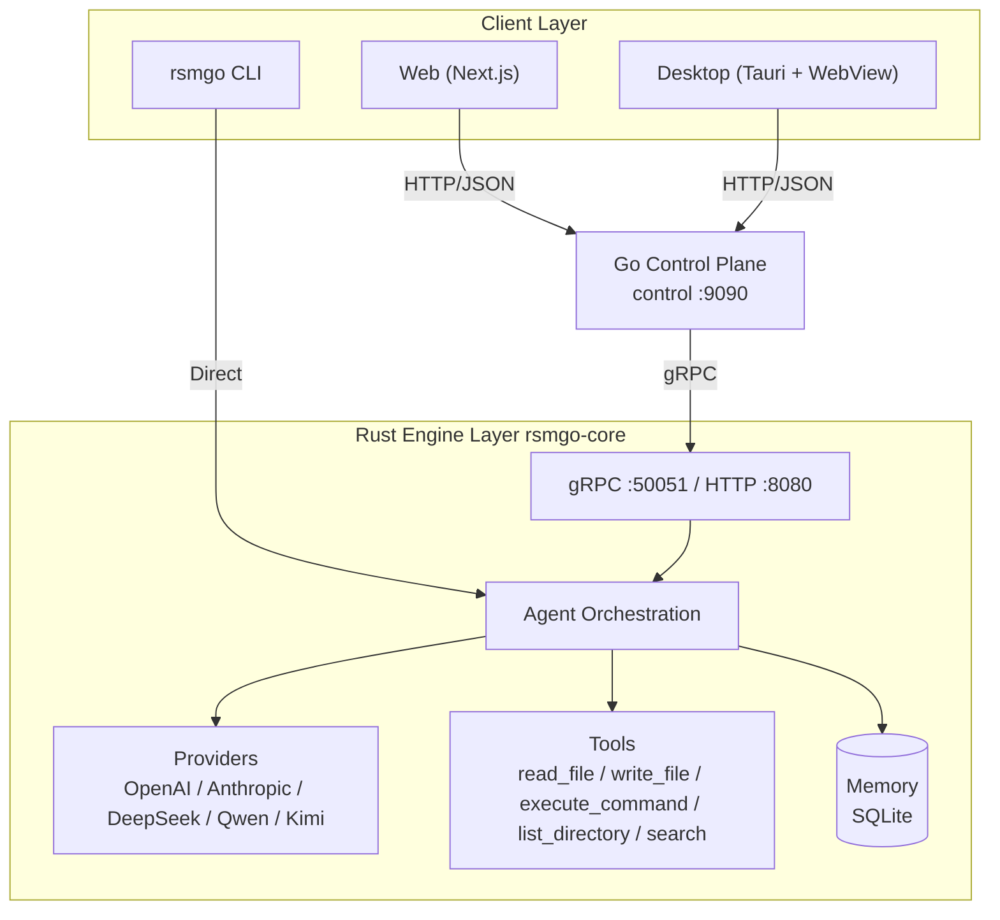

# rsmgo

> A model-agnostic AI Agent infrastructure.

**Language**: English | [中文](readme-zh.md)

rsmgo lets you connect to your preferred large language model (Claude, GPT, DeepSeek, Qwen, Kimi) and run an agent runtime locally with memory persistence and tool-call orchestration. The project is built with a polyglot architecture: Rust powers the core engine, Go runs the control plane and web gateway, Next.js provides the web UI, and Tauri wraps the desktop client.

---

## Table of Contents

- [Core Features](#core-features)
- [Architecture](#architecture)
- [Technology Stack](#technology-stack)
- [Directory Structure](#directory-structure)
- [Quick Start](#quick-start)
- [Configuration](#configuration)
- [Component Reference](#component-reference)
- [Future Evolution](#future-evolution)
- [License](#license)

---

## Core Features

- **Model-agnostic**: Unified LLM provider abstraction. Supports OpenAI, Anthropic, DeepSeek, Qwen, Kimi, and any other OpenAI-compatible endpoint. Adding a new provider only requires a `base_url` and a model list.
- **Agent runtime**: Built-in ReAct-style loop. The model can decide to invoke tools, and tool results are automatically fed back for follow-up reasoning.
- **Memory persistence**: Session and message history are stored in SQLite for long-term, cross-session memory.
- **Tool calling**: Built-in tools for file reading/writing, command execution, directory listing, and file searching. Tool definitions use JSON Schema so models can understand them.
- **Multi-protocol access**: The core engine exposes both gRPC (efficient internal communication) and HTTP/JSON (easy for frontends and third parties).
- **Multiple clients**: Command-line CLI, Next.js web UI, and Tauri desktop client.
- **Control-plane gateway**: The Go control plane handles session management, routing, CORS, and frontend proxying, decoupling the engine from the UI.
- **Environment-aware configuration**: `app.yaml` supports `${VAR}` environment variable expansion and `~` home-directory shorthand for flexible deployment.

---

## Architecture



### Design Highlights

1. **Engine layer (`rsmgo-core`, Rust)**
   - Handles LLM interaction, tool orchestration, memory access, and gRPC/HTTP serving.
   - `Agent` is the orchestration core: receive request → enrich with historical memory → call provider → if tool calls exist, execute them → submit results back to the model for a final response.
   - `ProviderRegistry` supports registering multiple providers at runtime. Anthropic uses its native protocol; everything else is treated as OpenAI-compatible.
   - `MemoryStore` provides transactional session and message storage via `rusqlite`.

2. **Control plane (`control`, Go)**
   - Acts as a gateway between frontends and the engine, exposing a unified RESTful API under `/api/v1/*`.
   - Responsible for session CRUD, message forwarding, health checks, and CORS.
   - Communicates with the Rust engine through a gRPC client.

3. **Frontend layer**
   - **Web**: Chat interface built with Next.js 16 and React 19. `next.config.js` rewrites `/api/*` to the control plane.
   - **Desktop**: Tauri 2 shell embedding the web frontend.

4. **CLI (`rsmgo-cli`, Rust)**
   - Links directly against `rsmgo-core` and can run interactive or one-shot chats without the control plane.

---

## Technology Stack

| Layer | Technology | Rationale |
|-------|------------|-----------|
| **Core engine** | Rust + Tokio | High-performance async runtime with memory safety, well suited for LLM inference orchestration and tool-call heavy I/O workloads. |
| **Engine web/gRPC services** | Axum + Tonic | Axum provides a modern HTTP API, Tonic provides high-performance gRPC, both deeply integrated with the Tokio ecosystem. |
| **Control-plane gateway** | Go + Gin | Go is mature and efficient for cloud-native gateways, HTTP routing, and concurrency; Gin is lightweight and widely adopted. |
| **Inter-service communication** | gRPC + Protocol Buffers | Efficient RPC between the control plane and engine; Protobuf offers strongly typed, cross-language interface contracts. |
| **Persistence** | SQLite (via `rusqlite`) | Lightweight, zero-config storage for local sessions and message history without requiring a separate database service. |
| **Web frontend** | Next.js 16 + React 19 + TypeScript | Modern React full-stack framework with App Router, SSR, and a great developer experience. |
| **Desktop client** | Tauri 2 | Embeds the frontend via the system WebView, yielding smaller bundles and lower resource usage than Electron. |
| **Configuration** | YAML + `serde_yaml` | Human-readable config format with support for environment-variable expansion and home-directory shorthand. |
| **Build tools** | Cargo / Go Modules / pnpm | Standard package managers and build tools for the Rust, Go, and Node ecosystems respectively. |

---

## Directory Structure

```text
rsmgo/
├── Cargo.toml                 # Rust workspace root
├── go.mod                     # Go module root
├── package.json               # pnpm workspace / script entrypoint
├── Makefile                   # Build, test, and code-generation tasks
├── app.yaml                   # Default runtime configuration (example)
├── app.exam.yaml              # Example with multiple providers
├── proto/
│   └── rsmgo.proto            # gRPC/Protobuf service definitions
├── crates/
│   ├── rsmgo-core/            # Rust core engine library + rsmgo-engine binary
│   │   ├── src/
│   │   │   ├── agent/         # Agent orchestration logic
│   │   │   ├── config/        # app.yaml loading and parsing
│   │   │   ├── memory/        # SQLite memory store
│   │   │   ├── providers/     # LLM provider abstraction and implementations
│   │   │   ├── server.rs      # gRPC + HTTP server
│   │   │   ├── tools/         # Tool registry and built-in tools
│   │   │   ├── types.rs       # Core domain types
│   │   │   └── bin/
│   │   │       └── rsmgo-engine.rs  # Engine entrypoint
│   │   └── Cargo.toml
│   ├── rsmgo-pb/              # Generated Rust protobuf code
│   │   └── src/
│   └── rsmgo-cli/             # Command-line client
│       └── src/main.rs
├── control/                   # Go control plane
│   ├── cmd/rsmgo-control/     # Control-plane main program
│   └── internal/
│       ├── api/               # HTTP API and routing
│       ├── config/            # Go-side configuration loading
│       ├── engine/            # gRPC engine client
│       └── session/           # Session file storage
├── pb/                        # Generated Go protobuf code
├── web/                       # Next.js web frontend
│   ├── app/                   # App Router pages
│   ├── components/            # React components
│   └── lib/api.ts             # Control-plane API client
└── desktop/                   # Tauri desktop client
    └── src-tauri/             # Tauri Rust shell project
```

---

## Quick Start

### Prerequisites

- Rust ≥ 1.85
- Go ≥ 1.26
- Node.js ≥ 20 + pnpm 9
- `protoc` (only if regenerating gRPC code)

Detailed installation steps:

1. Go to https://go.dev/dl/ and install Go for your operating system. Linux or macOS is recommended.
2. Set the Go module proxy (recommended for users in China):
   ```shell
   go env -w GOPROXY=https://goproxy.cn,direct
   ```
3. Install `protoc`:
   - On macOS:
     ```shell
     brew install automake libtool protobuf
     ```
   - On Linux:
     ```shell
     # Reference: https://grpc.io/docs/protoc-installation/
     PB_REL="https://github.com/protocolbuffers/protobuf/releases"
     curl -LO $PB_REL/download/v3.15.8/protoc-3.15.8-linux-x86_64.zip
     unzip -o protoc-3.15.8-linux-x86_64.zip -d $HOME/.local
     export PATH=~/.local/bin:$PATH  # Add this to your ~/.bashrc or ~/.zshrc
     protoc --version
     # libprotoc 3.15.8
     ```
4. Install Rust:
   ```shell
   # It is recommended to add these two environment variables to ~/.bash_profile or ~/.bashrc,
   # then run source ~/.bash_profile or source ~/.bashrc
   export RUSTUP_DIST_SERVER=https://mirrors.ustc.edu.cn/rust-static
   export RUSTUP_UPDATE_ROOT=https://mirrors.ustc.edu.cn/rust-static/rustup
   
   curl --proto '=https' --tlsv1.2 -sSf https://sh.rustup.rs | sh
   ```
   You can also use the rsproxy mirror (keep it consistent with the `replace-with` setting in `~/.cargo/config.toml`):
   ```shell
   export RUSTUP_DIST_SERVER="https://rsproxy.cn"
   export RUSTUP_UPDATE_ROOT="https://rsproxy.cn/rustup"
   ```
   Add the following to `~/.cargo/config.toml`:
   ```toml
   [source.crates-io]
   replace-with = 'ustc'
   
   [source.rsproxy]
   registry = "https://rsproxy.cn/crates.io-index"
   [source.rsproxy-sparse]
   registry = "sparse+https://rsproxy.cn/index/"
   
   [registries.rsproxy]
   index = "https://rsproxy.cn/crates.io-index"
   
   [source.tuna]
   registry = "https://mirrors.tuna.tsinghua.edu.cn/git/crates.io-index.git"
   
   [source.ustc]
   registry = "sparse+https://mirrors.ustc.edu.cn/crates.io-index/"
   
   [source.sjtu]
   registry = "https://mirrors.sjtug.sjtu.edu.cn/git/crates.io-index"
   
   [source.rustcc]
   registry = "git://crates.rustcc.cn/crates.io-index"
   
   [source.xuanwu]
   registry = "https://mirror.xuanwu.openatom.cn/crates.io-index"
   [source.xuanwu-sparse]
   registry = "sparse+https://mirror.xuanwu.openatom.cn/index/"
   [registries.xuanwu]
   index = "https://mirror.xuanwu.openatom.cn/crates.io-index"
   
   [net]
   git-fetch-with-cli = true
   [http]
   check-revoke = false
   ```
5. Download and install Node.js from https://nodejs.org/en/download.

### npm / pnpm mirror acceleration

```shell
npm config set registry https://registry.npmmirror.com
npm install -g pnpm
pnpm config set registry https://registry.npmmirror.com
```

### 1. Clone the repository

```bash
git clone https://github.com/daheige/rsmgo.git
cd rsmgo
```

### 2. Configure API keys

Copy `app.exam.yaml` to `app.yaml` and fill in the API key for your chosen model:

```yaml
providers:
  - name: deepseek
    api_key: "${DEEPSEEK_API_KEY}"
    base_url: "https://api.deepseek.com"
    default_model: "deepseek-chat"
    models:
      - id: "deepseek-chat"
        display_name: "DeepSeek V3"
```

Then export the environment variable:

```bash
export DEEPSEEK_API_KEY=sk-xxx
```

### 3. Run the Rust engine

```bash
cargo run -p rsmgo-core --bin rsmgo-engine
```

By default the engine listens on:
- gRPC: `127.0.0.1:50051`
- HTTP: `127.0.0.1:8080`

### 4. Run the Go control plane

```bash
go run ./control/cmd/rsmgo-control
```

By default the control plane listens on `0.0.0.0:9090`.

### 5. Run the Web frontend

```bash
cd web
pnpm install
pnpm dev
```

Open http://localhost:1338 to start chatting.

Server runtime preview:


Screenshot:


### 6. Run the desktop client (optional)

The Tauri desktop client embeds the web frontend, so keep the Rust engine (step 3), Go control plane (step 4), and web frontend (step 5) running first. `tauri dev` connects to the web dev server on port 1338.

> **Note**: Tauri requires system prerequisites — on macOS install Xcode Command Line Tools (`xcode-select --install`); on Linux install `libwebkit2gtk-4.1-dev` and related build dependencies; on Windows install Microsoft C++ Build Tools and WebView2. See the [Tauri prerequisites](https://tauri.app/start/prerequisites/).

```bash
cd desktop
pnpm install
pnpm dev
```

A native window opens via Tauri. To build an installer instead, run `pnpm tauri build`.

### 7. Use the CLI (optional)

```bash
cargo run -p rsmgo-cli -- chat
```

Or run a single prompt:

```bash
cargo run -p rsmgo-cli -- run "Write a quicksort in Rust"
```

---

## Configuration

`app.yaml` is the single source of runtime configuration. It supports the following top-level sections.

### `app`

Application metadata.

```yaml
app:
  name: rsmgo
  version: 0.1.0
```

### `engine`

Engine listening addresses, data directory, and system prompt.

```yaml
engine:
  grpc_addr: "127.0.0.1:50051"
  http_addr: "127.0.0.1:8080"
  data_dir: "./share/rsmgo"
  system_prompt: |
    You are rsmgo, a model-agnostic AI agent assistant...
```

- `data_dir`: Directory for SQLite and related persistence files. Supports relative paths (e.g. `./share/rsmgo`) as well as `~` home-directory expansion (e.g. `~/.local/share/rsmgo`).
- `system_prompt`: Overrides the default system prompt.

### `providers`

Configure available LLM providers. `anthropic` uses the native Anthropic API; all other names are treated as OpenAI-compatible.

```yaml
providers:
  - name: openai
    api_key: "${OPENAI_API_KEY}"
    base_url: "https://api.openai.com/v1"
    default_model: "gpt-4o-mini"
    models:
      - id: "gpt-4o"
        display_name: "GPT-4o"
```

### `tools`

Declare the default enabled tool whitelist.

```yaml
tools:
  enabled:
    - read_file
    - write_file
    - execute_command
    - list_directory
    - search
```

### `control_plane`

Go control-plane listening address and engine address.

```yaml
control_plane:
  addr: ":9090"
  engine_addr: "127.0.0.1:50051"
```

### Configuration resolution order

1. Path specified by the `RSMGO_CONFIG` environment variable
2. `~/.config/rsmgo/app.yaml`
3. `app.yaml` in the current working directory

---

## Component Reference

### rsmgo-core (Rust engine)

| Module | Description |
|--------|-------------|
| `agent` | Agent orchestration: request lifecycle, tool-call loop, and memory writes. |
| `config` | `app.yaml` parsing with environment variable and path expansion. |
| `memory` | SQLite-based session and message persistence. |
| `providers` | LLM provider trait, `OpenAiCompatibleProvider`, `AnthropicProvider`, and registry. |
| `server` | gRPC Engine service and Axum HTTP routes. |
| `tools` | Tool trait, registry, and built-in tool implementations. |
| `types` | Shared domain types: `Message`, `ChatRequest`, `ToolDefinition`, etc. |

### Built-in tools

| Tool name | Description |
|-----------|-------------|
| `read_file` | Read the contents of a file. |
| `write_file` | Write content to a file, creating parent directories as needed. |
| `execute_command` | Execute a shell command and return its output. |
| `list_directory` | List files and subdirectories at a path. |
| `search` | Recursively search for files by name pattern using `find`. |

### control (Go control plane)

| Module | Description |
|--------|-------------|
| `api` | Gin HTTP service, RESTful routes, CORS, and session endpoints. |
| `config` | Reads `app.yaml` and extracts control-plane-specific fields. |
| `engine` | gRPC client wrapper for communicating with the Rust engine. |
| `session` | Lightweight local JSON file store for sessions. |

### pb / rsmgo-pb (generated protobuf code)

| Directory | Description |
|-----------|-------------|
| `pb/` | Generated Go protobuf code (`make proto`). |
| `crates/rsmgo-pb/` | Generated Rust protobuf crate (`make proto`). |

### web (Next.js frontend)

| File/Directory | Description |
|----------------|-------------|
| `app/page.tsx` | Main page with session sidebar and active chat area. |
| `components/Chat.tsx` | Message list, input box, and send logic. |
| `lib/api.ts` | Client wrapper for control-plane `/api/v1/*` endpoints. |
| `next.config.js` | Standalone output and API reverse-proxy configuration. |

### desktop (Tauri desktop client)

Desktop shell based on Tauri 2 wrapping the web frontend. Build with:

```bash
cd desktop
pnpm install
pnpm tauri build
```

---

## Future Evolution

rsmgo is currently at the MVP stage. Planned directions include:

- **Streaming responses**: Implement `ChatStream` gRPC/HTTP streaming so frontends can receive model output in real time.
- **MCP support**: Adopt the Model Context Protocol to extend the tool ecosystem and external data sources.
- **Richer tools**: Add network requests, database queries, Git operations, browser automation, and more.
- **Multi-agent collaboration**: Task decomposition, sub-agent invocation, and result aggregation.
- **Enhanced memory**: Vector retrieval and long-term memory summarization for better cross-session continuity.
- **Permissions and safety**: Tool-call sandboxing, operation confirmation, and sensitive-command interception policies.
- **Authentication and multi-tenancy**: User authentication, API key management, and tenant isolation in the control plane.
- **Observability**: Built-in OpenTelemetry / Prometheus metrics and structured logging.
- **Plugin system**: Extend providers and tools via WASM or dynamic libraries.

---

## License

This project is open-sourced under the [Apache-2.0](LICENSE) license. Without the author's authorization, no entity or individual may use this project for commercial purposes in any form. Infringers will bear corresponding legal liability, and the author reserves all rights to pursue infringement liability through legal channels.
