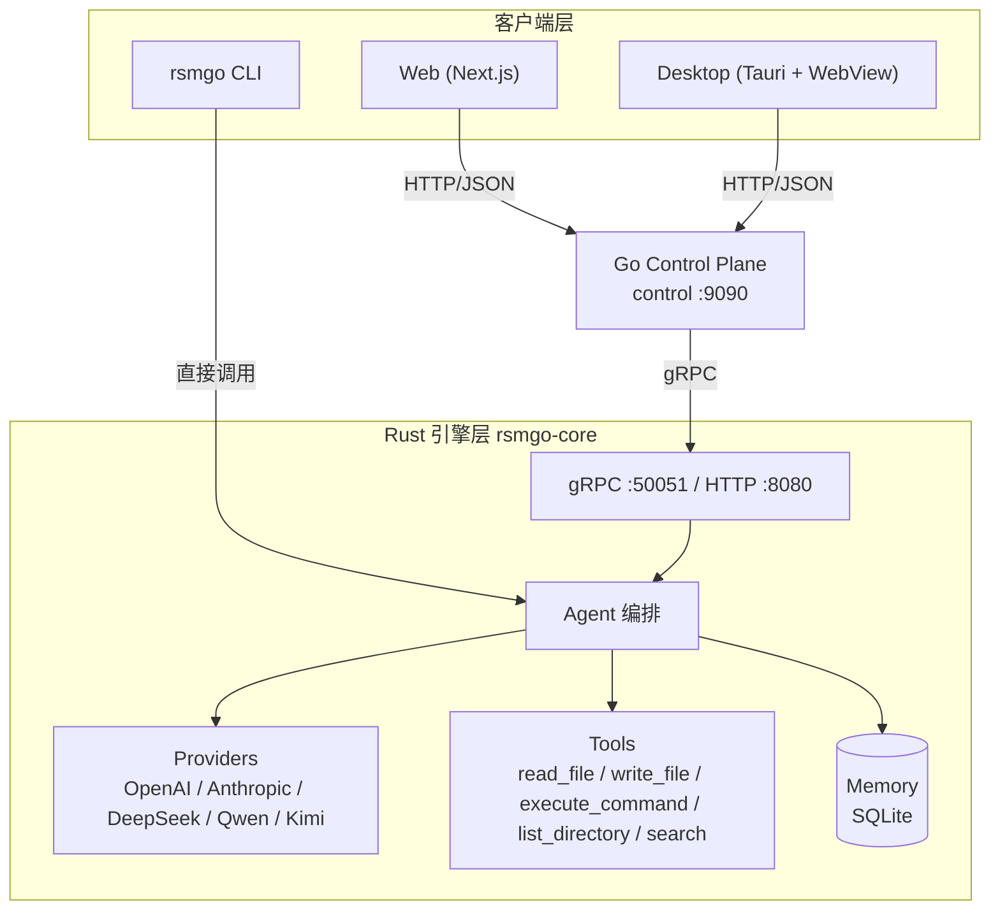
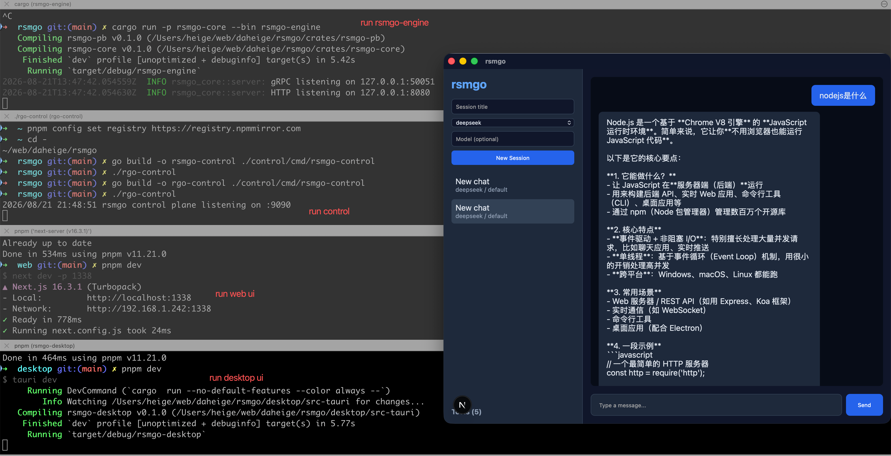
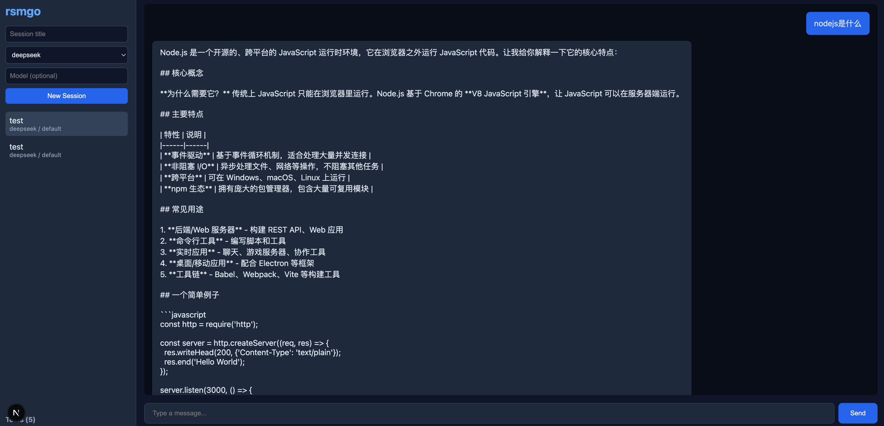

# rsmgo

> 一款模型无关的 AI Agent 基础设施的工具。

**语言 / Language**: 简体中文 | [English](README.md)

rsmgo 允许用户自由接入自己偏好的大语言模型（Claude、GPT、DeepSeek、通义千问、Kimi 等），并在本地提供 Agent 运行时、记忆持久化与工具调用编排能力。项目采用 Rust + Go + TypeScript 多语言架构：Rust 负责核心引擎，Go 负责控制面与 Web 网关，Next.js 提供 Web UI，Tauri 提供桌面客户端。

---

## 目录

- [核心特性](#核心特性)
- [架构设计](#架构设计)
- [技术栈选型](#技术栈选型)
- [目录结构](#目录结构)
- [快速开始](#快速开始)
- [配置文件](#配置文件)
- [组件说明](#组件说明)
- [未来演化](#未来演化)
- [许可证](#许可证)

---

## 核心特性

- **模型无关（Model-agnostic）**：统一抽象 LLM Provider，支持 OpenAI、Anthropic、DeepSeek、通义千问、Kimi 等多种模型，新增提供商只需配置 `base_url` 与模型列表。
- **Agent 运行时**：内置 ReAct 风格循环，模型可自主决定调用工具，工具结果自动回传并触发后续推理。
- **记忆持久化**：基于 SQLite 存储会话（session）与消息历史，支持跨会话长期记忆。
- **工具调用**：内置文件读写、命令执行、目录列出、文件搜索等常用工具，工具定义采用 JSON Schema，便于模型理解。
- **多协议接入**：核心引擎同时暴露 gRPC（高效内部通信）与 HTTP/JSON（便于前端与第三方接入）双协议。
- **多客户端**：提供命令行 CLI、Next.js Web 界面、Tauri 桌面客户端三种交互方式。
- **控制面网关**：Go 控制面负责会话管理、路由转发、CORS 与前端代理，解耦引擎与 UI。
- **环境感知配置**：`app.yaml` 支持 `${VAR}` 环境变量展开与 `~` 主目录简写，便于不同环境部署。

---

## 架构设计



### 设计要点

1. **引擎层（rsmgo-core，Rust）**
   - 负责与 LLM 交互、工具编排、记忆读写、gRPC/HTTP 服务。
   - `Agent` 是编排核心：接收请求 → 补全历史记忆 → 调用 Provider → 如有 tool_calls 则执行工具 → 将结果再次提交给模型生成最终回复。
   - `ProviderRegistry` 支持运行时注册多家模型；Anthropic 走原生协议，其余默认按 OpenAI 兼容协议处理。
   - `MemoryStore` 基于 `rusqlite` 提供事务化会话与消息存储。

2. **控制面（control，Go）**
   - 作为前端与引擎之间的网关，统一暴露 RESTful API（`/api/v1/*`）。
   - 负责会话的 CRUD、消息转发、健康检查与跨域支持。
   - 通过 gRPC 客户端与 Rust 引擎通信。

3. **前端层**
   - **Web**：基于 Next.js 16 + React 19 的聊天界面，通过 `next.config.js` 的 rewrites 将 `/api/*` 代理到控制面。
   - **Desktop**：基于 Tauri 2 构建桌面壳，内嵌 Web 前端。

4. **CLI（rsmgo-cli，Rust）**
   - 直接链接 `rsmgo-core`，无需控制面即可运行交互式聊天或单次提问。

---

## 技术栈选型

| 层级 | 技术 | 选型理由 |
|------|------|----------|
| **核心引擎** | Rust + Tokio | 高性能异步运行时，内存安全，适合承载 LLM 推理编排与工具调用等高 I/O 场景。 |
| **引擎 Web/gRPC 服务** | Axum + Tonic | Axum 提供现代化的 HTTP API，Tonic 提供高性能 gRPC 服务，二者与 Tokio 生态深度集成。 |
| **控制面网关** | Go + Gin | Go 在云原生网关、HTTP 路由、并发处理方面成熟高效，Gin 框架轻量且社区活跃。 |
| **进程间通信** | gRPC + Protocol Buffers | 控制面与引擎之间采用 gRPC 高效通信，Protobuf 提供强类型、跨语言的接口契约。 |
| **持久化** | SQLite (rusqlite) | 轻量零配置，足以支撑本地会话与消息历史存储，无需额外数据库服务。 |
| **Web 前端** | Next.js 16 + React 19 + TypeScript | 现代 React 全栈框架，支持 App Router、服务端渲染与良好的开发体验。 |
| **桌面客户端** | Tauri 2 | 使用系统 WebView 内嵌前端，包体小、性能好，替代 Electron 降低资源占用。 |
| **配置管理** | YAML + serde_yaml | 人类可读的配置格式，支持环境变量展开与主目录简写。 |
| **构建工具** | Cargo / Go Modules / pnpm | 分别对应 Rust、Go、Node 生态的标准包管理与构建工具。 |

---

## 目录结构

```text
rsmgo/
├── Cargo.toml                 # Rust workspace 根配置
├── go.mod                     # Go module 根配置
├── package.json               # pnpm workspace / 脚本入口
├── Makefile                   # 构建、测试、代码生成入口
├── app.yaml                   # 默认运行时配置（示例）
├── app.exam.yaml              # 多提供商配置示例
├── proto/
│   └── rsmgo.proto            # gRPC/Protobuf 接口定义
├── crates/
│   ├── rsmgo-core/            # Rust 核心引擎库 + rsmgo-engine 二进制
│   │   ├── src/
│   │   │   ├── agent/         # Agent 编排逻辑
│   │   │   ├── config/        # app.yaml 加载与解析
│   │   │   ├── memory/        # SQLite 记忆存储
│   │   │   ├── providers/     # LLM Provider 抽象与实现
│   │   │   ├── server.rs      # gRPC + HTTP 服务
│   │   │   ├── tools/         # 工具注册与内置工具
│   │   │   ├── types.rs       # 核心领域类型
│   │   │   └── bin/
│   │   │       └── rsmgo-engine.rs  # 引擎入口
│   │   └── Cargo.toml
│   ├── rsmgo-pb/              # 生成的 Rust protobuf 代码
│   │   └── src/
│   └── rsmgo-cli/             # 命令行客户端
│       └── src/main.rs
├── control/                   # Go 控制面
│   ├── cmd/rsmgo-control/     # 控制面主程序
│   └── internal/
│       ├── api/               # HTTP API 与路由
│       ├── config/            # Go 侧配置读取
│       ├── engine/            # gRPC 引擎客户端
│       └── session/           # 会话文件存储
├── pb/                        # 生成的 Go protobuf 代码
├── web/                       # Next.js Web 前端
│   ├── app/                   # App Router 页面
│   ├── components/            # React 组件
│   └── lib/api.ts             # 控制面 API 封装
└── desktop/                   # Tauri 桌面客户端
    └── src-tauri/             # Tauri Rust 桌面工具工程
```

---

## 快速开始

### 环境要求

- Rust ≥ 1.85
- Go ≥ 1.26
- Node.js ≥ 20 + pnpm 9
- `protoc`（如需重新生成 gRPC 代码）

相关工具安装步骤如下：
1. 进入 https://go.dev/dl/ 官方网站，根据系统安装不同的go版本，这里推荐在linux或mac系统上面安装go。
2. 设置Go GOPROXY 环境变量
```shell
go env -w GOPROXY=https://goproxy.cn,direct
```
3. 安装protoc工具
- mac系统安装方式如下：
```shell
brew install automake
brew install libtool
brew install protobuf
```
- linux系统安装方式如下：
```shell
# Reference: https://grpc.io/docs/protoc-installation/
PB_REL="https://github.com/protocolbuffers/protobuf/releases"
curl -LO $PB_REL/download/v3.15.8/protoc-3.15.8-linux-x86_64.zip
unzip -o protoc-3.15.8-linux-x86_64.zip -d $HOME/.local
export PATH=~/.local/bin:$PATH # Add this to your `~/.bashrc`.
protoc --version
libprotoc 3.15.8
```
4. 执行如下命令安装rust
```shell
# 下面两个环境变量，建议放在 ~/.bash_profile 或 ~/.bashrc 文件中
# 然后执行 source ~/.bash_profile 或 source ~/.bashrc 生效
export RUSTUP_DIST_SERVER=https://mirrors.ustc.edu.cn/rust-static
export RUSTUP_UPDATE_ROOT=https://mirrors.ustc.edu.cn/rust-static/rustup

curl --proto '=https' --tlsv1.2 -sSf https://sh.rustup.rs | sh
```
这里也可以使用rsproxy代理(建议跟`~/.cargo/config.toml`文件中的`replace-with`配置保持一致)，这里我使用的是`ustc`镜像源
```shell
export RUSTUP_DIST_SERVER="https://rsproxy.cn"
export RUSTUP_UPDATE_ROOT="https://rsproxy.cn/rustup"
```

通过 vim ~/.cargo/config.toml 文件添加如下内容：
```toml
[source.crates-io]
#registry = "https://github.com/rust-lang/crates.io-index"
# 指定镜像，这里可以根据实际情况选择不同的镜像
replace-with = 'ustc'

# 字节跳动的rsproxy，指定方式，只需要调整 [source.crates-io] 下面的 `replace-with = 'rsproxy-sparse'`
[source.rsproxy]
registry = "https://rsproxy.cn/crates.io-index"
[source.rsproxy-sparse]
registry = "sparse+https://rsproxy.cn/index/"

[registries.rsproxy]
index = "https://rsproxy.cn/crates.io-index"

# 清华大学
[source.tuna]
registry = "https://mirrors.tuna.tsinghua.edu.cn/git/crates.io-index.git"

# 中国科学技术大学
[source.ustc]
registry = "sparse+https://mirrors.ustc.edu.cn/crates.io-index/"

# 上海交通大学
[source.sjtu]
registry = "https://mirrors.sjtug.sjtu.edu.cn/git/crates.io-index"

# rustcc社区
[source.rustcc]
registry = "git://crates.rustcc.cn/crates.io-index"

# xuanwu社区，指定方式，只需要调整 [source.crates-io] 下面的 `replace-with = 'xuanwu-sparse'` 即可
[source.xuanwu]
registry = "https://mirror.xuanwu.openatom.cn/crates.io-index"
[source.xuanwu-sparse]
registry = "sparse+https://mirror.xuanwu.openatom.cn/index/"
[registries.xuanwu]
index = "https://mirror.xuanwu.openatom.cn/crates.io-index"

[net]
git-fetch-with-cli=true
[http]
check-revoke = false
```

5. 根据操作系统类型，在 https://nodejs.org/zh-cn/download 下载并安装nodejs

### 0. npm 和 pnpm 镜像加速
```shell
npm config set registry https://registry.npmmirror.com
sudo npm install -g pnpm
pnpm config set registry https://registry.npmmirror.com
```

### 1. 克隆仓库

```bash
git clone https://github.com/daheige/rsmgo.git
cd rsmgo
```

### 2. 配置 API 密钥

复制 `app.exam.yaml` 为 `app.yaml`，并填写目标模型的 API Key：

```yaml
providers:
  - name: deepseek
    api_key: "${DEEPSEEK_API_KEY}"
    base_url: "https://api.deepseek.com"
    default_model: "deepseek-chat"
    models:
      - id: "deepseek-chat"
        display_name: "DeepSeek V3"
```

然后导出环境变量：

```bash
export DEEPSEEK_API_KEY=sk-xxx
```

### 3. 运行 Rust 引擎

```bash
cargo run -p rsmgo-core --bin rsmgo-engine
```

引擎默认监听：
- gRPC：`127.0.0.1:50051`
- HTTP：`127.0.0.1:8080`

### 4. 运行 Go 控制面

```bash
go run ./control/cmd/rsmgo-control
```

控制面默认监听 `0.0.0.0:9090`。

### 5. 运行 Web 前端

```bash
cd web
pnpm install
pnpm dev
```

打开 http://localhost:1338 即可开始聊天。

服务端运行效果如下：


运行效果如下：



### 6. 运行桌面客户端（可选）

Tauri 桌面客户端内嵌 Web 前端，因此请先保持 Rust 引擎（第 3 步）、Go 控制面（第 4 步）与 Web 前端（第 5 步）运行。`tauri dev` 会连接 1338 端口上的 Web 开发服务器。

> **说明**：Tauri 需要系统依赖 —— macOS 需安装 Xcode 命令行工具（`xcode-select --install`）；Linux 需安装 `libwebkit2gtk-4.1-dev` 等构建依赖；Windows 需安装 Microsoft C++ Build Tools 与 WebView2。详见 [Tauri 系统依赖](https://tauri.app/start/prerequisites/)。

```bash
cd desktop
pnpm install
pnpm dev
```

将通过 Tauri 打开本地窗口。如需打包安装程序，可运行 `pnpm tauri build`。

### 7. 使用 CLI（可选）

```bash
cargo run -p rsmgo-cli -- chat
```

或单次运行：

```bash
cargo run -p rsmgo-cli -- run "用 Rust 写一个快速排序"
```

---

## 配置文件

`app.yaml` 是 rsmgo 的唯一主配置，支持以下顶层节点：

### `app`

应用元信息。

```yaml
app:
  name: rsmgo
  version: 0.1.0
```

### `engine`

核心引擎监听地址、数据目录与系统提示词。

```yaml
engine:
  grpc_addr: "127.0.0.1:50051"
  http_addr: "127.0.0.1:8080"
  data_dir: "./share/rsmgo"
  system_prompt: |
    You are rsmgo, a model-agnostic AI agent assistant...
```

- `data_dir`：SQLite 数据库与相关持久化文件存放路径，支持相对路径（如 `./share/rsmgo`）以及 `~` 主目录展开（如 `~/.local/share/rsmgo`）。
- `system_prompt`：覆盖默认系统提示词。

### `providers`

配置可用的 LLM 提供商列表。`anthropic` 使用原生 Anthropic API，其余名称默认按 OpenAI 兼容协议处理。

```yaml
providers:
  - name: openai
    api_key: "${OPENAI_API_KEY}"
    base_url: "https://api.openai.com/v1"
    default_model: "gpt-4o-mini"
    models:
      - id: "gpt-4o"
        display_name: "GPT-4o"
```

### `tools`

声明默认启用的工具白名单。

```yaml
tools:
  enabled:
    - read_file
    - write_file
    - execute_command
    - list_directory
    - search
```

### `control_plane`

Go 控制面监听地址与引擎地址。

```yaml
control_plane:
  addr: ":9090"
  engine_addr: "127.0.0.1:50051"
```

### 配置加载顺序

1. 环境变量 `RSMGO_CONFIG` 指定的路径
2. `~/.config/rsmgo/app.yaml`
3. 当前工作目录下的 `app.yaml`

---

## 组件说明

### rsmgo-core（Rust 引擎）

| 模块 | 说明 |
|------|------|
| `agent` | Agent 编排，处理请求生命周期、工具调用循环与记忆写入。 |
| `config` | `app.yaml` 解析、环境变量展开、路径展开。 |
| `memory` | 基于 SQLite 的会话与消息持久化。 |
| `providers` | LLM Provider Trait、`OpenAiCompatibleProvider`、`AnthropicProvider` 与注册表。 |
| `server` | gRPC Engine 服务与 Axum HTTP 路由。 |
| `tools` | 工具 Trait、注册表与内置工具实现。 |
| `types` | 跨模块共享的领域类型（Message、ChatRequest、ToolDefinition 等）。 |

### 内置工具

| 工具名 | 说明 |
|--------|------|
| `read_file` | 读取指定文件内容。 |
| `write_file` | 写入内容到文件，自动创建父目录。 |
| `execute_command` | 执行 shell 命令并返回输出。 |
| `list_directory` | 列出目录下的文件与子目录。 |
| `search` | 使用 `find` 按文件名模式递归搜索。 |

### control（Go 控制面）

| 模块 | 说明 |
|------|------|
| `api` | Gin HTTP 服务、RESTful 路由、CORS、会话接口。 |
| `config` | 读取 `app.yaml` 并提取控制面所需字段。 |
| `engine` | gRPC 客户端，封装与 Rust 引擎的通信。 |
| `session` | 基于本地 JSON 文件的轻量会话存储。 |

### pb / rsmgo-pb（生成的 protobuf 代码）

| 目录 | 说明 |
|------|------|
| `pb/` | 生成的 Go protobuf 代码（`make proto`）。 |
| `crates/rsmgo-pb/` | 生成的 Rust protobuf crate（`make proto`）。 |

### web（Next.js 前端）

| 文件/目录 | 说明 |
|-----------|------|
| `app/page.tsx` | 主页面，会话侧边栏与当前聊天区。 |
| `components/Chat.tsx` | 消息列表、输入框与发送逻辑。 |
| `lib/api.ts` | 对控制面 `/api/v1/*` 接口的封装。 |
| `next.config.js` | standalone 输出与 API 反向代理配置。 |

### desktop（Tauri 桌面客户端）

基于 Tauri 2 封装 Web 前端，提供本地窗口应用。构建命令：

```bash
cd desktop
pnpm install
pnpm tauri build
```

---

## 未来演化

rsmgo 当前处于 MVP 阶段，后续计划在以下方向持续演进：

- **流式响应**：实现 `ChatStream` gRPC/HTTP 流式接口，让前端可实时接收模型输出。
- **MCP 协议支持**：接入 Model Context Protocol，扩展工具生态与外部数据源。
- **更丰富的工具**：增加网络请求、数据库查询、Git 操作、浏览器自动化等工具。
- **多 Agent 协作**：支持任务分解、子 Agent 调用与结果汇总。
- **记忆增强**：引入向量检索与长期记忆摘要，提升跨会话连贯性。
- **权限与安全**：工具调用沙箱化、操作确认、敏感命令拦截策略。
- **认证与多租户**：控制面增加用户认证、API 密钥管理与租户隔离。
- **可观测性**：内置 OpenTelemetry / Prometheus 指标与结构化日志。
- **插件系统**：允许通过 WASM / 动态库扩展 Provider 与 Tool。

---

## 许可证

本项目采用 [Apache-2.0](LICENSE) 许可证开源。未经作者授权，任何单位或个人不得以任何形式将本项目用于商业目的。侵权者将承担相应的法律责任，作者保留通过法律途径追究侵权责任的一切权利。
