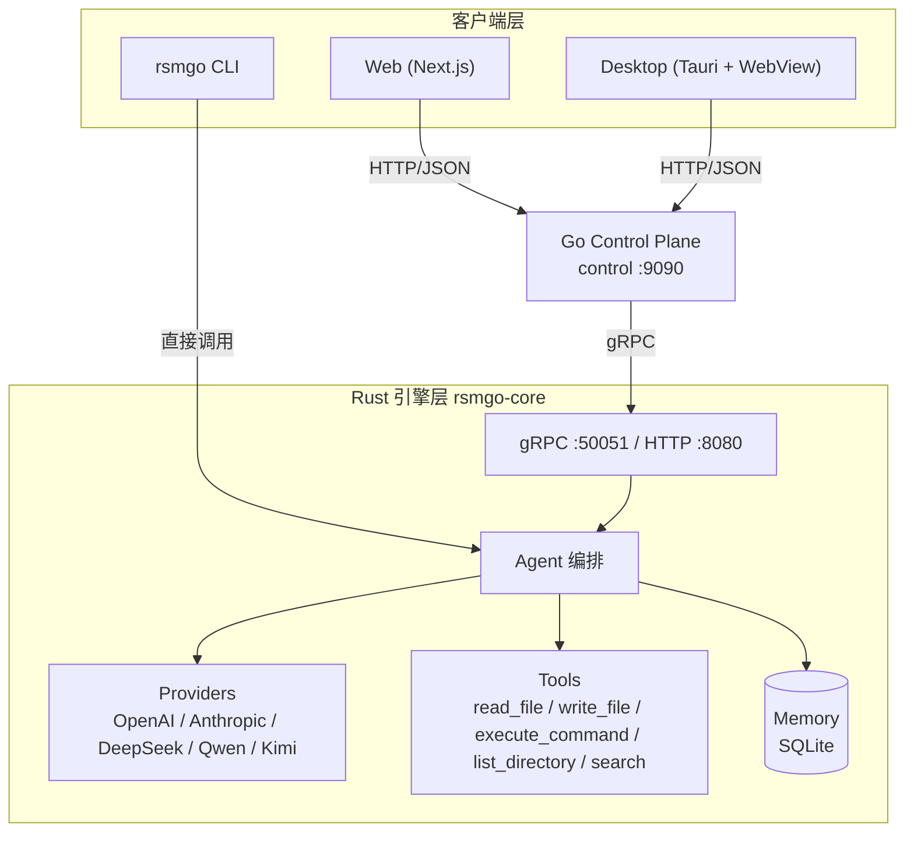
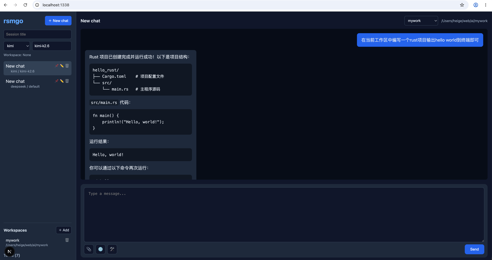

# rsmgo

> 一款模型无关的 AI Agent 基础设施的工具。

**语言 / Language**: 简体中文 | [English](README.md)

rsmgo 允许用户自由接入自己偏好的大语言模型（Claude、GPT、DeepSeek、通义千问、Kimi 等），并在本地提供 Agent 运行时、记忆持久化与工具调用编排能力。项目采用 Rust + Go + TypeScript 多语言架构：Rust 负责核心引擎，Go 负责控制面与 Web 网关，Next.js 提供 Web UI，Tauri 提供桌面客户端。

---

## 目录

- [核心特性](#核心特性)
- [架构设计](#架构设计)
- [技术栈选型](#技术栈选型)
- [目录结构](#目录结构)
- [快速开始](#快速开始)
- [配置文件](#配置文件)
- [工具使用](#工具使用)
- [Docker 运行环境](#docker-运行环境)
- [常见问题与注意事项](#常见问题与注意事项)
- [rsmgo http 服务调试](#rsmgo-http服务调试)
- [组件说明](#组件说明)
- [未来演化](#未来演化)
- [许可证](#许可证)

---

## 核心特性

- **模型无关（Model-agnostic）**：统一抽象 LLM Provider，支持 OpenAI、Anthropic、DeepSeek、通义千问、Kimi 等多种模型，新增提供商只需配置 `base_url` 与模型列表。
- **Agent 运行时**：内置 ReAct 风格循环，模型可自主决定调用工具，工具结果自动回传并触发后续推理。
- **记忆持久化**：基于 SQLite 存储会话（session）与消息历史，支持跨会话长期记忆。
- **工具调用**：内置文件读写、命令执行、目录列出、文件搜索、联网搜索、网页抓取等常用工具，工具定义采用 JSON Schema，便于模型理解。工具默认不启用，前端可手动勾选，避免普通聊天问题被强制触发工具调用。
- **多模态附件**：支持上传图片、PDF、DOCX、文本等附件。图片会作为多模态内容发送给 vision 模型；文本与文档内容会提取后嵌入用户消息。
- **DSML/XML 工具调用兼容**：部分 OpenAI 兼容模型（如 DeepSeek、Kimi）会把工具调用以 `<| | DSML | | tool_calls>` 形式输出到 content 中，引擎会自动解析并执行，最终只向用户展示模型总结后的答案。
- **多协议接入**：核心引擎同时暴露 gRPC（高效内部通信）与 HTTP/JSON（便于前端与第三方接入）双协议。
- **多客户端**：提供命令行 CLI、Next.js Web 界面、Tauri 桌面客户端三种交互方式。
- **控制面网关**：Go 控制面负责会话管理、路由转发、CORS 与前端代理，解耦引擎与 UI。
- **停止生成**：在界面中停止进行中的对话——前端中止请求，并通知控制面取消引擎侧的生成。
- **富文本渲染与消息操作**：助手回复以 Markdown 渲染，代码块按语言自动语法高亮并提供一键复制；每条助手消息带复制按钮，最后一条消息带「重新生成」按钮，可原地重跑上一次回答。
- **工作区**：在侧边栏添加并管理本地目录工作区，每个工作区可勾选允许使用的工具（工具级权限）。会话选择了工作区时，Agent 直接在该目录内读写（把它当作真正的工作目录），且仅能调用该工作区允许的工具；未设置工作区时，文件退回默认 `outputs/` 目录并提供下载链接。
- **环境感知配置**：`app.yaml` 支持 `${VAR}` 环境变量展开与 `~` 主目录简写，便于不同环境部署。

---

## 架构设计



### 设计要点

1. **引擎层（rsmgo-core，Rust）**
   - 负责与 LLM 交互、工具编排、记忆读写、gRPC/HTTP 服务。
   - `Agent` 是编排核心：接收请求 → 补全历史记忆 → 调用 Provider → 如有 tool_calls 则执行工具 → 将结果再次提交给模型生成最终回复。
   - 工具仅在请求中显式指定 `tool_names` 时才会暴露给模型；前端默认不勾选任何工具，普通聊天不会触发工具调用。
   - 对于把工具调用以 DSML/XML 形式写入 `content` 的 OpenAI 兼容模型，引擎会解析该 markup、执行对应工具，并把原始 markup 从最终回复中剥离。
   - `ProviderRegistry` 支持运行时注册多家模型；Anthropic 走原生协议，其余默认按 OpenAI 兼容协议处理。
   - `MemoryStore` 基于 `rusqlite` 提供事务化会话与消息存储。

2. **控制面（control，Go）**
   - 作为前端与引擎之间的网关，统一暴露 RESTful API（`/api/v1/*`）。
   - 负责会话的 CRUD、工作区管理、会话取消、消息转发、健康检查与跨域支持。
   - 通过 gRPC 客户端与 Rust 引擎通信。

3. **前端层**
   - **Web**：基于 Next.js 16 + React 19 的聊天界面，通过 `next.config.js` 的 rewrites 将 `/api/*` 代理到控制面。界面提供停止按钮以取消进行中的生成，以及侧边栏用于管理本地工作区目录。
   - **Desktop**：基于 Tauri 2 构建桌面壳，内嵌同一套 Web 前端（构建时静态导出），因此自动继承所有 Web 功能。

4. **CLI（rsmgo-cli，Rust）**
   - 直接链接 `rsmgo-core`，无需控制面即可运行交互式聊天或单次提问。

---

## 技术栈选型

| 层级 | 技术 | 选型理由 |
|------|------|----------|
| **核心引擎** | Rust + Tokio | 高性能异步运行时，内存安全，适合承载 LLM 推理编排与工具调用等高 I/O 场景。 |
| **引擎 Web/gRPC 服务** | Axum + Tonic | Axum 提供现代化的 HTTP API，Tonic 提供高性能 gRPC 服务，二者与 Tokio 生态深度集成。 |
| **控制面网关** | Go + Gin | Go 在云原生网关、HTTP 路由、并发处理方面成熟高效，Gin 框架轻量且社区活跃。 |
| **进程间通信** | gRPC + Protocol Buffers | 控制面与引擎之间采用 gRPC 高效通信，Protobuf 提供强类型、跨语言的接口契约。 |
| **持久化** | SQLite (rusqlite) | 轻量零配置，足以支撑本地会话与消息历史存储，无需额外数据库服务。 |
| **Web 前端** | Next.js 16 + React 19 + TypeScript | 现代 React 全栈框架，支持 App Router、服务端渲染与良好的开发体验。 |
| **桌面客户端** | Tauri 2 | 使用系统 WebView 内嵌前端，包体小、性能好，替代 Electron 降低资源占用。 |
| **配置管理** | YAML + serde_yaml | 人类可读的配置格式，支持环境变量展开与主目录简写。 |
| **构建工具** | Cargo / Go Modules / pnpm | 分别对应 Rust、Go、Node 生态的标准包管理与构建工具。 |

---

## 目录结构

```text
rsmgo/
├── Cargo.toml                 # Rust workspace 根配置
├── go.mod                     # Go module 根配置
├── package.json               # pnpm workspace / 脚本入口
├── Makefile                   # 构建、测试、代码生成入口
├── app.yaml                   # 默认运行时配置（示例）
├── app.exam.yaml              # 多提供商配置示例
├── proto/
│   └── rsmgo.proto            # gRPC/Protobuf 接口定义
├── crates/
│   ├── rsmgo-core/            # Rust 核心引擎库 + rsmgo-engine 二进制
│   │   ├── src/
│   │   │   ├── agent/         # Agent 编排逻辑
│   │   │   ├── config/        # app.yaml 加载与解析
│   │   │   ├── memory/        # SQLite 记忆存储
│   │   │   ├── providers/     # LLM Provider 抽象与实现
│   │   │   ├── server.rs      # gRPC + HTTP 服务
│   │   │   ├── tools/         # 工具注册与内置工具
│   │   │   ├── types.rs       # 核心领域类型
│   │   │   └── bin/
│   │   │       └── rsmgo-engine.rs  # 引擎入口
│   │   └── Cargo.toml
│   ├── rsmgo-pb/              # 生成的 Rust protobuf 代码
│   │   └── src/
│   └── rsmgo-cli/             # 命令行客户端
│       └── src/main.rs
├── control/                   # Go 控制面
│   ├── cmd/rsmgo-control/     # 控制面主程序
│   └── internal/
│       ├── api/               # HTTP API 与路由
│       ├── config/            # Go 侧配置读取
│       ├── engine/            # gRPC 引擎客户端
│       ├── session/           # 会话文件存储
│       └── workspace/         # 工作区目录存储
├── pb/                        # 生成的 Go protobuf 代码
├── web/                       # Next.js Web 前端
│   ├── app/                   # App Router 页面
│   ├── components/            # React 组件
│   └── lib/api.ts             # 控制面 API 封装
└── desktop/                   # Tauri 桌面客户端
    └── src-tauri/             # Tauri Rust 桌面工具工程
```

---

## 快速开始

### 环境要求

- Rust ≥ 1.85
- Go ≥ 1.26
- Node.js ≥ 20 + pnpm 9
- `protoc`（如需重新生成 gRPC 代码）

相关工具安装步骤如下：
1. 进入 https://go.dev/dl/ 官方网站，根据系统安装不同的go版本，这里推荐在linux或mac系统上面安装go。
2. 设置Go GOPROXY 环境变量
```shell
go env -w GOPROXY=https://goproxy.cn,direct
```
3. 安装protoc工具
- mac系统安装方式如下：
```shell
brew install automake
brew install libtool
brew install protobuf
```
- linux系统安装方式如下：
```shell
# Reference: https://grpc.io/docs/protoc-installation/
PB_REL="https://github.com/protocolbuffers/protobuf/releases"
curl -LO $PB_REL/download/v3.15.8/protoc-3.15.8-linux-x86_64.zip
unzip -o protoc-3.15.8-linux-x86_64.zip -d $HOME/.local
export PATH=~/.local/bin:$PATH # Add this to your `~/.bashrc`.
protoc --version
libprotoc 3.15.8
```
4. 执行如下命令安装rust
```shell
# 下面两个环境变量，建议放在 ~/.bash_profile 或 ~/.bashrc 文件中
# 然后执行 source ~/.bash_profile 或 source ~/.bashrc 生效
export RUSTUP_DIST_SERVER=https://mirrors.ustc.edu.cn/rust-static
export RUSTUP_UPDATE_ROOT=https://mirrors.ustc.edu.cn/rust-static/rustup

curl --proto '=https' --tlsv1.2 -sSf https://sh.rustup.rs | sh
```
这里也可以使用rsproxy代理(建议跟`~/.cargo/config.toml`文件中的`replace-with`配置保持一致)，这里我使用的是`ustc`镜像源
```shell
export RUSTUP_DIST_SERVER="https://rsproxy.cn"
export RUSTUP_UPDATE_ROOT="https://rsproxy.cn/rustup"
```

通过 vim ~/.cargo/config.toml 文件添加如下内容：
```toml
[source.crates-io]
#registry = "https://github.com/rust-lang/crates.io-index"
# 指定镜像，这里可以根据实际情况选择不同的镜像
replace-with = 'ustc'

# 字节跳动的rsproxy，指定方式，只需要调整 [source.crates-io] 下面的 `replace-with = 'rsproxy-sparse'`
[source.rsproxy]
registry = "https://rsproxy.cn/crates.io-index"
[source.rsproxy-sparse]
registry = "sparse+https://rsproxy.cn/index/"

[registries.rsproxy]
index = "https://rsproxy.cn/crates.io-index"

# 清华大学
[source.tuna]
registry = "https://mirrors.tuna.tsinghua.edu.cn/git/crates.io-index.git"

# 中国科学技术大学
[source.ustc]
registry = "sparse+https://mirrors.ustc.edu.cn/crates.io-index/"

# 上海交通大学
[source.sjtu]
registry = "https://mirrors.sjtug.sjtu.edu.cn/git/crates.io-index"

# rustcc社区
[source.rustcc]
registry = "git://crates.rustcc.cn/crates.io-index"

# xuanwu社区，指定方式，只需要调整 [source.crates-io] 下面的 `replace-with = 'xuanwu-sparse'` 即可
[source.xuanwu]
registry = "https://mirror.xuanwu.openatom.cn/crates.io-index"
[source.xuanwu-sparse]
registry = "sparse+https://mirror.xuanwu.openatom.cn/index/"
[registries.xuanwu]
index = "https://mirror.xuanwu.openatom.cn/crates.io-index"

[net]
git-fetch-with-cli=true
[http]
check-revoke = false
```

5. 根据操作系统类型，在 https://nodejs.org/zh-cn/download 下载并安装nodejs

### 0. npm 和 pnpm 镜像加速
```shell
npm config set registry https://registry.npmmirror.com
sudo npm install -g pnpm
pnpm config set registry https://registry.npmmirror.com
```

### 1. 克隆仓库

```bash
git clone https://github.com/daheige/rsmgo.git
cd rsmgo
```

### 2. 配置 API 密钥

编辑 `app.yaml`（或复制 `app.exam.yaml` 为 `app.yaml`），配置你要使用的提供商。可以直接在文件中填写 API Key，也可以使用 `${VAR}` 占位符从环境变量读取：

```yaml
providers:
  - name: deepseek
    api_key: "${DEEPSEEK_API_KEY}"
    base_url: "https://api.deepseek.com"
    default_model: "deepseek-chat"
    models:
      - id: "deepseek-chat"
        display_name: "DeepSeek V3"
```

如果使用占位符，在 shell 中导出对应变量（`.env` 文件只是可选方式，不是必需的）：

```bash
export DEEPSEEK_API_KEY=sk-xxx
```

也可以直接把 Key 写在 `app.yaml` 中：

```yaml
providers:
  - name: deepseek
    api_key: "sk-xxx"
```

### 3. 运行 Rust 引擎

```bash
cargo run -p rsmgo-core --bin rsmgo-engine
```

引擎默认监听：
- gRPC：`127.0.0.1:50051`
- HTTP：`127.0.0.1:8080`

### 4. 编译并运行 Go 控制面

```bash
go build -o rgo-control ./control/cmd/rsmgo-control
./rgo-control
```

控制面默认监听 `0.0.0.0:9090`。

### 5. 运行 Web 前端

```bash
cd web
pnpm install
pnpm dev
```

打开 http://localhost:1338 即可开始聊天。

服务端运行效果如下：


运行效果如下：


### 6. 运行桌面客户端（可选）

Tauri 桌面客户端内嵌 Web 前端，因此请先保持 Rust 引擎（第 3 步）、Go 控制面（第 4 步）与 Web 前端（第 5 步）运行。`tauri dev` 会连接 1338 端口上的 Web 开发服务器。

> **说明**：Tauri 需要系统依赖 —— macOS 需安装 Xcode 命令行工具（`xcode-select --install`）；Linux 需安装 `libwebkit2gtk-4.1-dev` 等构建依赖；Windows 需安装 Microsoft C++ Build Tools 与 WebView2。详见 [Tauri 系统依赖](https://tauri.app/start/prerequisites/)。

```bash
cd desktop
pnpm install
pnpm dev
```

将通过 Tauri 打开本地窗口。如需打包安装程序，可运行 `pnpm tauri build`——构建会静态导出 Web 前端（输出到 `web/out`），因此打包后的应用只需 Rust 引擎与 Go 控制面运行即可，它会直连 `http://localhost:9090` 控制面，无需 Web 开发服务器。

### 7. 使用 CLI（可选）

```bash
cargo run -p rsmgo-cli -- chat
```

或单次运行：

```bash
cargo run -p rsmgo-cli -- run "用 Rust 写一个快速排序"
```

## 工作区 workspace 运行方式

工作区是一个本地目录，Agent 会把它当作自己的真正工作目录，直接在其中读写文件、执行命令。使用步骤如下：

1. **添加工作区**：在左侧边栏的「Workspaces」区点击「Add」，填写名称（可留空，默认取目录名）并指定一个已存在的本地目录。桌面端可点击「Browse」通过系统原生目录选择器选择；普通浏览器中需手动填写绝对路径。
2. **勾选工具权限**：添加时可勾选该工作区允许 Agent 使用的工具（工具级权限，默认全部允许；留空表示不限制）。
3. **选择工作区**：点击侧边栏中的工作区使其成为当前激活工作区，新建会话会自动继承它；也可以在会话头部的工作区选择器中为某个会话单独切换。
4. **开始使用**：在该会话中发送请求后，Agent 会被告知工作区路径，读写文件、执行命令都基于该目录进行。

运行效果如下：



> 未设置工作区时，文件默认写入 `{data_dir}/outputs/` 并提供下载链接；设置工作区后，文件直接写入工作区目录，详见 [工具使用](#工具使用)。

---

## 配置文件

`app.yaml` 是 rsmgo 的唯一主配置。环境变量仅在 `app.yaml` 中作为 `${VAR}` 占位符被替换时使用；`.env` 文件是可选的，不是配置本体。支持以下顶层节点：

### `app`

应用元信息。

```yaml
app:
  name: rsmgo
  version: 0.1.0
```

### `engine`

核心引擎监听地址、数据目录与系统提示词。

```yaml
engine:
  grpc_addr: "127.0.0.1:50051"
  http_addr: "127.0.0.1:8080"
  app_http_debug: true
  chat_stream: true
  data_dir: "./share/rsmgo"
  system_prompt: |
    You are rsmgo, a model-agnostic AI agent assistant...
```

- `grpc_addr`：引擎 gRPC 监听地址，是控制面（Go）与引擎之间的主通信通道。
- `http_addr`：引擎内置 HTTP/JSON 调试接口的监听地址，仅当 `app_http_debug` 为 `true` 时启动。
- `app_http_debug`：是否启动 HTTP 调试接口。`false`（默认）时仅监听 gRPC，减少端口暴露；`true` 时同时监听 gRPC 与 HTTP，便于本地调试。详见 [rsmgo http 服务调试](#rsmgo-http服务调试)。
- `chat_stream`：是否默认以流式方式输出助手回复。`true`（默认）时前端调用 `/api/v1/sessions/:id/chat?stream=true` 会实时返回 SSE 数据；`false` 时即使前端请求流式，控制面也会把完整响应缓冲后一次性以 SSE 返回。该配置同时作用于 Go 控制面与 Rust 引擎的 HTTP 调试接口 `/api/v1/chat/stream`。
- `data_dir`：SQLite 数据库与相关持久化文件存放路径，支持相对路径（如 `./share/rsmgo`）以及 `~` 主目录展开（如 `~/.local/share/rsmgo`）。
- `system_prompt`：前置到默认系统提示词之前。最终提示词为 `{默认系统提示词}\n\n{system_prompt}`，因此即使配置了自定义提示词，保留 `write_file` 下载链接等关键指令也会始终生效。

### `providers`

配置可用的 LLM 提供商列表。`anthropic` 使用原生 Anthropic API，其余名称默认按 OpenAI 兼容协议处理。`base_url` 请以 `/v1` 结尾，模型 `id` 需与目标服务商实际提供的模型名称保持一致，否则会遇到 404 错误。

```yaml
providers:
  - name: openai
    api_key: "${OPENAI_API_KEY}"
    base_url: "https://api.openai.com/v1"
    default_model: "gpt-4o-mini"
    models:
      - id: "gpt-4o"
        display_name: "GPT-4o"

  - name: kimi
    api_key: "${MOONSHOT_API_KEY}"
    base_url: "https://api.moonshot.cn/v1"
    default_model: "moonshot-v1-8k"
    models:
      - id: "moonshot-v1-8k"
        display_name: "Moonshot V1 8K"
      - id: "moonshot-v1-8k-vision-preview"
        display_name: "Moonshot V1 8K Vision"
```

### `tools`

声明控制面 `/api/v1/tools` 返回的工具白名单，以及引擎默认注册的工具集合。实际聊天时，工具默认不启用，需要在前端工具菜单中手动勾选才会传递给模型。

```yaml
tools:
  enabled:
    - read_file
    - write_file
    - execute_command
    - list_directory
    - search
    - web_search
    - fetch_url
```

### `control_plane`

Go 控制面监听地址与引擎地址。

```yaml
control_plane:
  addr: ":9090"
  engine_addr: "127.0.0.1:50051"
```

### 配置加载顺序

1. 环境变量 `RSMGO_CONFIG` 指定的路径
2. `~/.config/rsmgo/app.yaml`
3. 当前工作目录下的 `app.yaml`

---

## 工具使用

### 启用方式

工具需要两步启用：

1. **服务端白名单**：在 `app.yaml` 的 `tools.enabled` 中列出要注册的工具，未列出的工具不会出现在前端。
2. **前端勾选**：聊天界面工具菜单（🛠）中手动勾选本次对话要使用的工具。默认不勾选任何工具，避免普通聊天问题被强制触发工具调用。

### 内置工具列表

| 工具名 | 说明 | 参数 |
|--------|------|------|
| `read_file` | 读取指定文件内容。 | `path`: 文件绝对或相对路径 |
| `write_file` | 写入内容到文件，自动创建父目录。工作区内路径相对工作目录解析，否则相对 `outputs/`。 | `path`: 文件名或相对路径；`content`: 文件内容 |
| `execute_command` | 执行 shell 命令并返回 stdout/stderr。 | `command`: 命令；`working_dir`（可选）: 工作目录 |
| `list_directory` | 列出目录下的文件与子目录。 | `path`: 目录路径 |
| `search` | 使用 `find` 按文件名模式递归搜索。 | `directory`: 搜索目录；`pattern`: 文件名模式，如 `*.rs` |
| `web_search` | 联网搜索。 | `query`: 搜索关键词 |
| `fetch_url` | 抓取指定网页并返回文本内容。 | `url`: 目标网页地址 |

### 使用示例

在 `app.yaml` 中启用工具：

```yaml
tools:
  enabled:
    - read_file
    - write_file
    - execute_command
    - list_directory
    - search
    - web_search
    - fetch_url
```

重启引擎后，前端工具菜单会显示这些工具。勾选 `list_directory` 后发送“列出当前目录”，模型可能会调用：

```json
{
  "name": "list_directory",
  "arguments": { "path": "." }
}
```

工具执行结果会回传给模型，模型再生成最终的自然语言回答。

### 文件写入与下载

`write_file` 的写入位置取决于会话是否选择了工作区：

- **未设置工作区（默认）**：文件写入 `{data_dir}/outputs/`，工具返回下载链接。模型在最终回答中保留该链接后，前端会自动渲染“下载”按钮，用户可通过 `/api/v1/files/{filename}` 下载文件。
- **已选择工作区**：工作区目录即 Agent 的真正工作目录，文件直接写入该目录（例如 `notes/todo.md` 落到 `{workspace}/notes/todo.md`），不返回下载链接，直接从该目录读取即可。

未设置工作区时，工具返回类似：

```text
File written: outputs/my.md
Download: [Download my.md](/api/v1/files/my.md)
```

前端会显示一个绿色的“Download my.md”按钮。

- `write_file` 仅在解析后的目录内写入（默认 `{data_dir}/outputs/`，或设置工作区后的工作区目录）。路径相对于该目录解析，任何包含 `..` 的路径都会被拒绝，以防止目录遍历。
- `/api/v1/files/{filename}` 端点只提供 `{data_dir}/outputs/` 下的文件，并使用简单的 basename 查找，因此生成的文件无法逃逸出工作区。

### 工作区

工作区是 Agent 视为真正工作目录的本地目录，Agent 会直接在其中读写文件并执行命令。通过侧边栏管理工作区：

- **添加**：点击「Add」填写名称与目录路径（桌面端可用系统原生目录选择器，浏览器需手动填写绝对路径）。名称可留空，默认取目录的基名；路径必须是已存在的目录。
- **选择**：每个会话在聊天头部都有工作区选择器，可单独切换会话的工作区；新建会话会继承侧边栏当前选中的工作区。
- **删除**：从侧边栏删除工作区（仅移除引用，不会删除目录或其文件）。

工作区生效后的具体行为：

- **提示词注入**：引擎会在系统提示词末尾追加 `The user's workspace directory is: <path>. Prefer relative paths within it when reading or writing files.`，让模型优先使用工作区内的相对路径。
- **路径解析**：`read_file`、`list_directory`、`search` 等工具的相对路径会基于工作区目录解析，绝对路径保持不变；`write_file` 还会自动剥离模型误带的工作区绝对路径前缀，避免在工作区内嵌套出冗余目录。
- **文件写入**：`write_file` 直接写入工作区目录，不返回下载链接；未设置工作区时才写入 `{data_dir}/outputs/` 并返回下载链接（见 [文件写入与下载](#文件写入与下载)）。
- **命令执行**：`execute_command` 未显式指定 `working_dir` 时，默认以工作区为当前目录运行。
- **工具权限**：工作区勾选的工具会与本次请求的工具取交集，即 Agent 只能调用该工作区允许的工具；工具列表为空表示不限制。

工作区以 JSON 文件形式存储在 `{data_dir}/workspaces/` 下，每个文件对应一个工作区（`id`、`name`、`path`、`tools`、`created_at`）。相关的控制面 REST 接口为：

| 方法 | 路径 | 说明 |
|------|------|------|
| `GET` | `/api/v1/workspaces` | 列出所有工作区 |
| `POST` | `/api/v1/workspaces` | 创建工作区（`name`、`path`、`tools`） |
| `DELETE` | `/api/v1/workspaces/:id` | 删除工作区（仅移除引用） |
| `GET` | `/api/v1/workspaces/:id/files/:name` | 下载写入工作区 `outputs/` 子目录的文件 |

### 安全提示

- `execute_command` 与 `write_file` 会实际执行命令或写入文件，请谨慎勾选。
- 建议仅对可信模型和明确需要文件操作的会话启用写入/执行类工具。
- 工具运行在本地环境，权限与启动 rsmgo 的用户一致。

---

## Docker 运行环境

项目已提供 [Dockerfile](Dockerfile) 与 [docker-entrypoint.sh](docker-entrypoint.sh)，可在单个容器内同时启动：

- Rust 引擎 gRPC（`0.0.0.0:50051`）
- Rust 引擎 HTTP 调试接口（`0.0.0.0:8080`）
- Go 控制面（`0.0.0.0:9090`）
- Next.js Web UI（`0.0.0.0:1338`）

[docker-compose.yaml](docker-compose.yaml) 默认将项目根目录的 [app.yaml](app.yaml) 以 `-v` 方式挂载到 `engine` 与 `control` 容器中，并通过环境变量覆盖跨容器所需的地址：

- `engine`：`RSMGO_GRPC_ADDR=0.0.0.0:50051`、`RSMGO_HTTP_ADDR=0.0.0.0:8080`
- `control`：`RSMGO_ENGINE_ADDR=engine:50051`

[Makefile](Makefile) 已封装常用命令：

```bash
# 构建镜像
docker compose build

# 启动服务。如果 app.yaml 使用了 ${VAR} 占位符，可在 shell 中设置变量，
# 或使用可选的 .env 文件（见 .env.example）。也可以直接把 Key 写入 app.yaml。
# cp .env.example .env   # 可选，仅在你想用 .env 文件时
# 编辑 .env，填写 DEEPSEEK_API_KEY 等实际使用的模型密钥
docker compose up -d

# 或继续使用 Makefile
make docker-build
make docker-run

# 查看日志
make docker-logs

# 停止并删除容器
make docker-stop
```

运行后访问 http://localhost:1338 即可使用 Web UI。

### 端口说明

| 端口 | 服务 |
|------|------|
| `1338` | Web UI |
| `9090` | Go 控制面 |
| `8080` | Rust 引擎 HTTP 调试接口 |
| `50051` | Rust 引擎 gRPC |

### 数据持久化与自定义配置

Compose 默认使用 `rsmgo-data` Docker volume，挂载到 `engine` 与 `control` 容器的 `/app/share/rsmgo`，用于保存会话、记忆与工作区数据。

默认通过 `-v ./app.yaml:/app/app.yaml:ro` 挂载项目根目录的 [app.yaml](app.yaml)。如需使用自定义配置，直接修改 `app.yaml` 即可；容器内会通过环境变量自动覆盖引擎监听地址与控制面引擎地址，无需手动改动 `engine.grpc_addr` / `control_plane.engine_addr`。

---

## 常见问题与注意事项

### 1. Kimi / Moonshot 返回 404 `resource_not_found_error`

通常是 `base_url` 或模型 `id` 写错了。Moonshot 官方 API 的 `base_url` 应为：

```yaml
base_url: "https://api.moonshot.cn/v1"
```

有效模型示例：`moonshot-v1-8k`、`moonshot-v1-32k`、`moonshot-v1-128k`、`moonshot-v1-8k-vision-preview`。若使用第三方转发或内部 endpoint，请确保该地址真实存在且模型 ID 与服务商一致。

### 2. 图片上传后模型“看不懂”

只有 vision 模型才能把图片作为多模态内容处理。非 vision 模型（如 `deepseek-chat`）只能看到文件名文本。如需图片理解，请在 `app.yaml` 中启用 vision 模型，例如：

```yaml
providers:
  - name: kimi
    api_key: "${MOONSHOT_API_KEY}"
    base_url: "https://api.moonshot.cn/v1"
    default_model: "moonshot-v1-8k-vision-preview"
    models:
      - id: "moonshot-v1-8k-vision-preview"
        display_name: "Moonshot V1 8K Vision"
```

或启用 OpenAI `gpt-4o`、Gemini `gemini-2.5-flash`、Qwen `qwen-vl-max` 等 vision 模型。

### 3. 普通聊天问题也触发工具调用

工具默认不会自动启用。聊天界面工具菜单（🛠）里未勾选任何工具时，模型不会收到工具定义。若勾选了工具，模型认为有必要时才会调用。

---

## rsmgo http 服务调试

引擎除了 gRPC（默认 `127.0.0.1:50051`）之外，还内置了一个轻量的 HTTP/JSON 调试接口（默认 `127.0.0.1:8080`）。它直接绑定到引擎内部同一个 `Agent`，与 gRPC 走的是同一套业务逻辑，仅传输层不同。

> 该 HTTP 服务是**调试/辅助用途**。主业务流程（Web/桌面 → Go 控制面 `:9090` → gRPC `:50051` → 引擎）并不经过它，因此即使关掉也不影响任何主流程，仅方便 `curl` 调试与健康检查。

### 开关控制

通过 `app.yaml` 的 `engine.app_http_debug` 控制是否启动该 HTTP 服务：

```yaml
engine:
  grpc_addr: "127.0.0.1:50051"
  http_addr: "127.0.0.1:8080"
  app_http_debug: true   # true：启动 HTTP 调试接口；false：只跑 gRPC
```

- `app_http_debug: false`（默认）：不启动 HTTP 服务，引擎仅监听 gRPC，减少端口暴露。
- `app_http_debug: true`：gRPC 与 HTTP 双监听，便于本地 `curl` 调试与健康检查。

### 路由

| 方法 | 路径 | 作用 |
|------|------|------|
| `GET` | `/health` | 健康检查，返回 `status` 与 `version` |
| `POST` | `/api/v1/chat` | 直接以 JSON `ChatRequest` 调用 `Agent::chat`（不经 gRPC） |
| `POST` | `/api/v1/chat/stream` | 以 SSE 方式流式调用 `Agent::chat_stream`；若 `chat_stream: false` 则整体缓冲后一次性返回 |
| `GET` | `/api/v1/tools` | 列出已注册工具及其定义 |
| `GET` | `/api/v1/providers` | 列出已配置的 provider 名称 |

### 示例

健康检查：

```bash
curl http://127.0.0.1:8080/health
```

直接对话（请求体与 `types::ChatRequest` 一致）：

```bash
curl -X POST http://127.0.0.1:8080/api/v1/chat \
  -H 'Content-Type: application/json' \
  -d '{
    "session_id": "debug-1",
    "provider": "deepseek",
    "model": "deepseek-chat",
    "messages": [{"role": "user", "content": "你好"}]
  }'
```

流式对话（SSE）：

```bash
curl -N -X POST http://127.0.0.1:8080/api/v1/chat/stream \
  -H 'Content-Type: application/json' \
  -H 'Accept: text/event-stream' \
  -d '{
    "session_id": "debug-1",
    "provider": "deepseek",
    "model": "deepseek-chat",
    "messages": [{"role": "user", "content": "你好"}]
  }'
```

列出工具与提供商：

```bash
curl http://127.0.0.1:8080/api/v1/tools
curl http://127.0.0.1:8080/api/v1/providers
```

---

## 组件说明

### rsmgo-core（Rust 引擎）

| 模块 | 说明 |
|------|------|
| `agent` | Agent 编排，处理请求生命周期、工具调用循环与记忆写入。 |
| `config` | `app.yaml` 解析、环境变量展开、路径展开。 |
| `memory` | 基于 SQLite 的会话与消息持久化。 |
| `providers` | LLM Provider Trait、`OpenAiCompatibleProvider`、`AnthropicProvider` 与注册表。 |
| `server` | gRPC Engine 服务与 Axum HTTP 路由。 |
| `tools` | 工具 Trait、注册表与内置工具实现。 |
| `types` | 跨模块共享的领域类型（Message、ChatRequest、ToolDefinition 等）。 |

### 内置工具

完整工具列表、参数说明与安全提示见 [工具使用](#工具使用) 章节。工具实现位于 `crates/rsmgo-core/src/tools/`。

### control（Go 控制面）

| 模块 | 说明 |
|------|------|
| `api` | Gin HTTP 服务、RESTful 路由、CORS、会话接口。 |
| `config` | 读取 `app.yaml` 并提取控制面所需字段。 |
| `engine` | gRPC 客户端，封装与 Rust 引擎的通信。 |
| `session` | 基于本地 JSON 文件的轻量会话存储。 |
| `workspace` | 基于本地 JSON 文件的轻量工作区目录存储。 |

### pb / rsmgo-pb（生成的 protobuf 代码）

| 目录 | 说明 |
|------|------|
| `pb/` | 生成的 Go protobuf 代码（`make proto`）。 |
| `crates/rsmgo-pb/` | 生成的 Rust protobuf crate（`make proto`）。 |

### web（Next.js 前端）

| 文件/目录 | 说明 |
|-----------|------|
| `app/page.tsx` | 主页面，会话侧边栏、工作区管理与当前聊天区。 |
| `components/Chat.tsx` | 消息列表、输入框、附件上传与发送/停止逻辑。助手消息以 Markdown 渲染，代码块按语言自动语法高亮并提供一键复制，文件下载链接会显示为下载按钮；每条助手消息带复制按钮，最后一条消息可重新生成。工具默认不启用，需通过工具菜单手动勾选。 |
| `lib/api.ts` | 对控制面 `/api/v1/*` 接口的封装。 |
| `next.config.js` | standalone / 静态导出输出与 API 反向代理配置。 |

### desktop（Tauri 桌面客户端）

基于 Tauri 2 封装 Web 前端，提供本地窗口应用。`tauri build` 会静态导出 Web 前端（`web/out`）并嵌入原生二进制，应用直连 `http://localhost:9090` 控制面。构建命令：

```bash
cd desktop
pnpm install
pnpm tauri build
```

---

## 未来演化

rsmgo 当前处于 MVP 阶段，后续计划在以下方向持续演进：

- **MCP 协议支持**：接入 Model Context Protocol，扩展工具生态与外部数据源。
- **更丰富的工具**：增加网络请求、数据库查询、Git 操作、浏览器自动化等工具。
- **多 Agent 协作**：支持任务分解、子 Agent 调用与结果汇总。
- **记忆增强**：引入向量检索与长期记忆摘要，提升跨会话连贯性。
- **权限与安全**：工具调用沙箱化、操作确认、敏感命令拦截策略。
- **认证与多租户**：控制面增加用户认证、API 密钥管理与租户隔离。
- **可观测性**：内置 OpenTelemetry / Prometheus 指标与结构化日志。
- **插件系统**：允许通过 WASM / 动态库扩展 Provider 与 Tool。

---

## 许可证

本项目采用 [Apache-2.0](LICENSE) 许可证开源。未经作者授权，任何单位或个人不得以任何形式将本项目用于商业目的。侵权者将承担相应的法律责任，作者保留通过法律途径追究侵权责任的一切权利。
